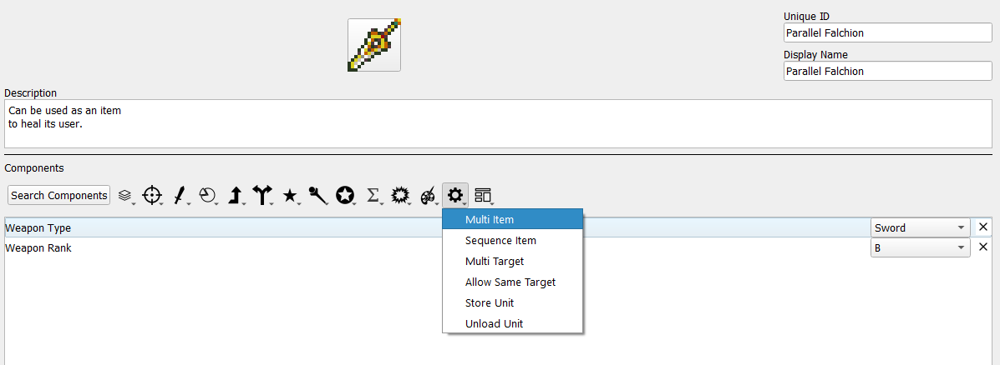
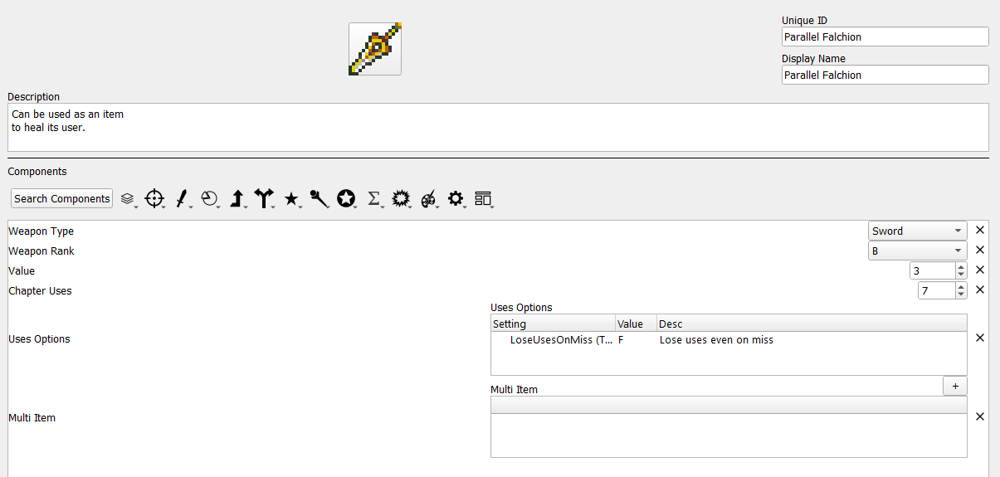
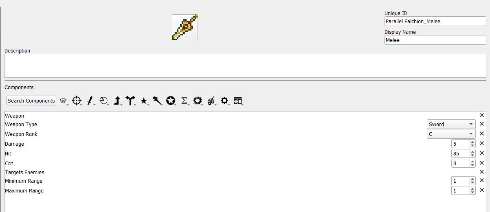
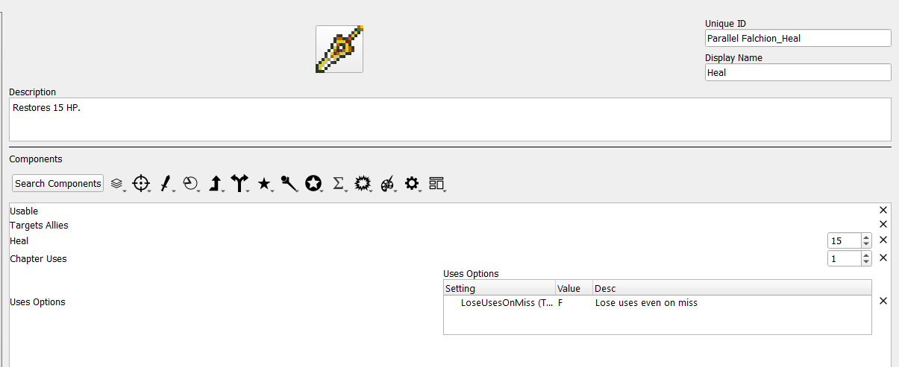
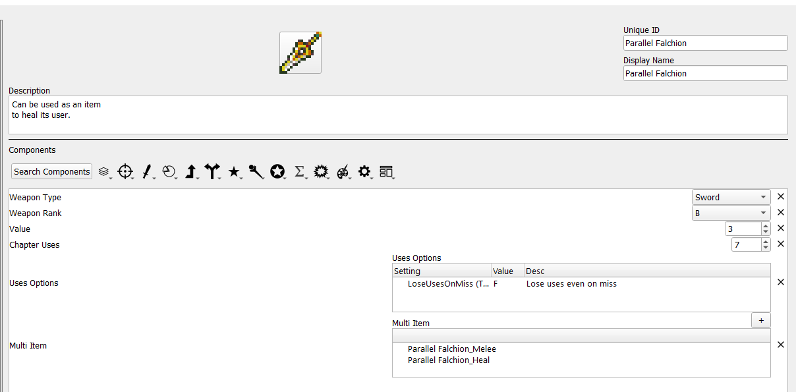

<a href="../../../index.html" class="icon icon-home">lt-maker</a>

Contents:

- <a href="../../home.html" class="reference internal">Lex Talionis
  Wiki</a>

Getting Started:

- <a href="../../getting_started/index.html"
  class="reference internal">Getting Started</a>

Editor Guides:

- <a href="../../editors/Editors-Overview.html"
  class="reference internal">Editors Overview</a>
- <a href="../../editors/index.html"
  class="reference internal">Editors</a>

Events:

- <a href="../../events/index.html" class="reference internal">Events</a>

Guides:

- <a href="../Guides-Overview.html" class="reference internal">Guides
  Overview</a>
- <a href="../index.html" class="reference internal">Guides</a>
  - <a href="../setup_tutorials/index.html"
    class="reference internal">Project Setup Tutorials</a>
  - <a href="../eventing_tutorials/index.html"
    class="reference internal">Eventing Tutorials</a>
  - <a href="index.html" class="reference internal">Skill and Item
    Tutorials</a>
    - <a href="Creating-Items.html" class="reference internal">0. Creating
      Items</a>
    - <a href="Direct-Passives.html" class="reference internal">1. Direct
      Passives - Hit +20, MAG +2 and Gamble</a>
    - <a href="Conditional-Passives-I.html" class="reference internal">2.
      Conditional Passives I - Lucky Seven, Odd Rhythm, Wrath and Quick
      Burn</a>
    - <a href="Conditional-Passives-II.html" class="reference internal">4.
      Conditional Passives II - Warding Blow, Rainlashslayer</a>
    - <a href="Conditional-Passives-III.html" class="reference internal">3.
      Conditional Passives III - Tomefaire, Axe Breaker and Wyrmbane</a>
    - <a href="Tile-Passives.html" class="reference internal">4. Tile Oriented
      Passives - Outdoor Fighter and Indoor Fighter</a>
    - <a href="Auras.html" class="reference internal">3. Auras - Hex, Bond and
      Focus</a>
    - <a href="Skill-Swap.html" class="reference internal">[System] Skill
      Swap</a>
    - <a href="Creating-Capture.html" class="reference internal">Capture
      skill</a>
    - <a href="Recruit-Skill.html" class="reference internal">Recruit
      Skill</a>
    - <a href="Summoning.html" class="reference internal">Summoning</a>
    - <a href="Shelter-Skill.html" class="reference internal">Shelter
      Skill</a>
    - <a href="Multi-Items.html#" class="current reference internal">Multi
      Items</a>
      - <a href="Multi-Items.html#what-is-a-multi-item"
        class="reference internal">What is a multi item?</a>
      - <a href="Multi-Items.html#how-do-i-make-a-multi-item"
        class="reference internal">How do I make a multi item?</a>
      - <a href="Multi-Items.html#why-do-i-make-a-multi-item"
        class="reference internal">Why do I make a multi item?</a>
    - <a href="Nihil.html" class="reference internal">Nihil</a>

appendix:

- <a href="../../appendix/Text-Formatting-Commands.html"
  class="reference internal">Text Formatting Commands</a>
- <a href="../../appendix/Item-Component-Reference.html"
  class="reference internal">Item Component Dictionary</a>
- <a href="../../appendix/Skill-Component-Reference.html"
  class="reference internal">Skill Component Dictionary</a>
- <a href="../../appendix/Special-Variables.html"
  class="reference internal">Special Variables</a>
- <a href="../../appendix/Special-Tags.html"
  class="reference internal">Special Tags</a>
- <a href="../../appendix/trigger-reference.html"
  class="reference internal">Event Triggers</a>
- <a href="../../appendix/Random-Seed-Mechanics.html"
  class="reference internal">Random Seed Mechanics</a>
- <a href="../../appendix/FAQ.html" class="reference internal">Frequently
  Asked Questions</a>
- <a href="../../appendix/Contributing_to_the_LTWiki.html"
  class="reference internal">Contributing to the LTWiki</a>
- <a href="../../appendix/index.html" class="reference internal">Code
  Documentation</a>

[lt-maker](../../../index.html)

- 
- [Guides](../index.html)
- [Skill and Item Tutorials](index.html)
- Multi Items
- <a
  href="https://gitlab.com/rainlash/lt-maker/blob/master/docs/source/guides/skill_item_tutorials/Multi-Items.md"
  class="fa fa-gitlab">Edit on GitLab</a>

------------------------------------------------------------------------

# Multi Items<a href="Multi-Items.html#multi-items" class="headerlink"
title="Link to this heading"></a>

*Credit to Zelix for the Parallel Falchion icon used for this tutorial.*

## What is a multi item?<a href="Multi-Items.html#what-is-a-multi-item" class="headerlink"
title="Link to this heading"></a>

Multi items are items which consist of one or more other items. These
inner items, referred to here as sub items, are usable by the unit like
any other item they possess, although multi items have some unique
properties:

- When an item inside a multi item is used, a use is consumed from both
  the multi item and its sub item. If only the multi item or sub item
  has infinite uses, a use is still consumed from the other.

- A unit must fulfill restrictions set by both the multi item and a sub
  item to use that sub item. For example, if the multi item has a sword
  rank and the sub item has a lance rank, the user would need both sword
  and lance ranks.

- Multi items are stored in the convoy based on the weapon type of the
  multi item, rather than any of the sub items.

## How do I make a multi item?<a href="Multi-Items.html#how-do-i-make-a-multi-item" class="headerlink"
title="Link to this heading"></a>

**Step 1: Create the multi item.**

Open the item editor and create a new item. For this example, we will be
creating the Parallel Falchion, a sword that can also be used as an item
to heal the user.

Once you add the Multi Item component, you should add other components
that apply to the item as a whole. In this case, a weapon type, uses,
and price are appropriate. Specific stats like hit rate and damage
should be left to the sub items. The multi item itself is also
intentionally not a weapon despite having a weapon type, as the weapons
that are meant to be “equipped” are the sub items in this case. It is
also perfectly valid to not include the weapon type at this stage and
only have weapon types associated wtih the sub items.

When initially added, the multi item component will be blank. Once sub
items are created, they can be added here.

**Step 3: Create sub items.**

Sub items can be created as normal. If the uses of the sub item are
meant to be tied to the multi item, then no uses need to be specified.
Other shared information can be omitted as well.

As the below example illustrates, the two functions of a multi item do
not necessarily need to be related to each other, as the healing portion
of the Parallel Falchion would be treated as a usable item rather than a
weapon.

You may notice that there is a chapter uses component associated with
the healing sub item. You can associate uses to the sub items to have
certain options of a multi item be usable only a limited number of
times. Any time a sub item is used, one use will be subtracted from the
multi item as well (if the multi item has uses). However, using one sub
item will not subtract a use from another sub item. Sub items also do
not need to have their own uses; if a multi item has uses and a sub item
does not, using that sub item will still subtract a use from the multi
item.

**Step 4: Add the sub items to the multi item.**

Return to the multi item and use the + symbol above the multi item
component to add the sub items, which will be displayed in a drop down
list of all items. Theoretically any item can be added to multi item as
a sub item, allowing this component great flexibility.

After this, the Parallel Falchion can be used in-game as a multi item.

## Why do I make a multi item?<a href="Multi-Items.html#why-do-i-make-a-multi-item" class="headerlink"
title="Link to this heading"></a>

The scenario given in this example is fairly simple: a sword that can
harm and heal. However, multi items have many uses beyond that. They can
represent a weapon with a limited-use finisher attack, by having a multi
item consisting of one normal use sub item and one powerful sub item
with only one use. They do not need to be limited to weaponry, either; a
multi item could be a tome with no properties of its own that contains
various spells for healing or status ailments, each having its own mana
cost. Thus, if you have any item at all which has more than one
function, the multi item component is likely to be of use.

<a href="Shelter-Skill.html" class="btn btn-neutral float-left"
accesskey="p" rel="prev" title="Shelter Skill"> Previous</a>
<a href="Nihil.html" class="btn btn-neutral float-right" accesskey="n"
rel="next" title="Nihil">Next </a>

------------------------------------------------------------------------

© Copyright 2024, rainlash.

Built with [Sphinx](https://www.sphinx-doc.org/) using a
[theme](https://github.com/readthedocs/sphinx_rtd_theme) provided by
[Read the Docs](https://readthedocs.org).

