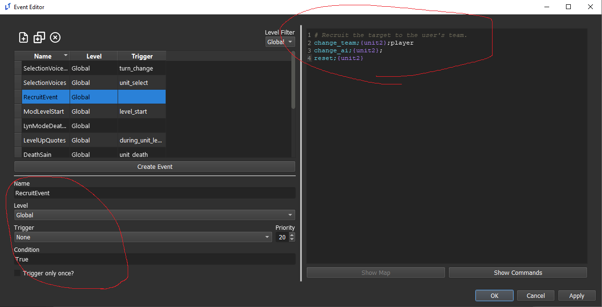
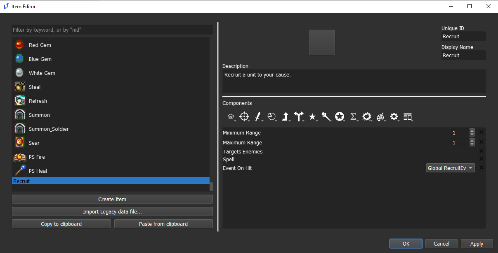
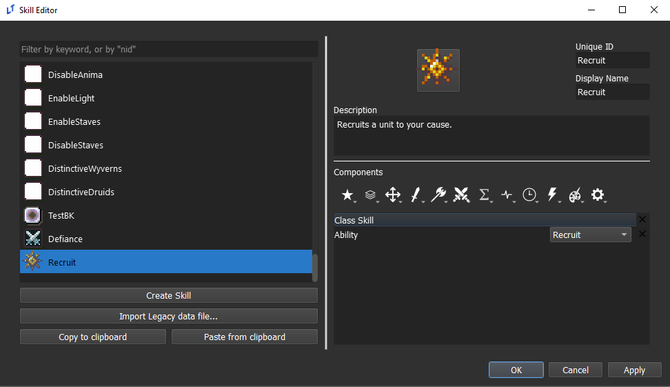
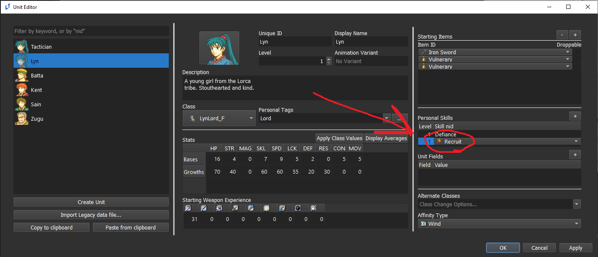

<a href="../../../index.html" class="icon icon-home">lt-maker</a>

Contents:

- <a href="../../home.html" class="reference internal">Lex Talionis
  Wiki</a>

Getting Started:

- <a href="../../getting_started/index.html"
  class="reference internal">Getting Started</a>

Editor Guides:

- <a href="../../editors/Editors-Overview.html"
  class="reference internal">Editors Overview</a>
- <a href="../../editors/index.html"
  class="reference internal">Editors</a>

Events:

- <a href="../../events/index.html" class="reference internal">Events</a>

Guides:

- <a href="../Guides-Overview.html" class="reference internal">Guides
  Overview</a>
- <a href="../index.html" class="reference internal">Guides</a>
  - <a href="../setup_tutorials/index.html"
    class="reference internal">Project Setup Tutorials</a>
  - <a href="../eventing_tutorials/index.html"
    class="reference internal">Eventing Tutorials</a>
  - <a href="index.html" class="reference internal">Skill and Item
    Tutorials</a>
    - <a href="Creating-Items.html" class="reference internal">0. Creating
      Items</a>
    - <a href="Direct-Passives.html" class="reference internal">1. Direct
      Passives - Hit +20, MAG +2 and Gamble</a>
    - <a href="Conditional-Passives-I.html" class="reference internal">2.
      Conditional Passives I - Lucky Seven, Odd Rhythm, Wrath and Quick
      Burn</a>
    - <a href="Conditional-Passives-II.html" class="reference internal">4.
      Conditional Passives II - Warding Blow, Rainlashslayer</a>
    - <a href="Conditional-Passives-III.html" class="reference internal">3.
      Conditional Passives III - Tomefaire, Axe Breaker and Wyrmbane</a>
    - <a href="Tile-Passives.html" class="reference internal">4. Tile Oriented
      Passives - Outdoor Fighter and Indoor Fighter</a>
    - <a href="Auras.html" class="reference internal">3. Auras - Hex, Bond and
      Focus</a>
    - <a href="Skill-Swap.html" class="reference internal">[System] Skill
      Swap</a>
    - <a href="Creating-Capture.html" class="reference internal">Capture
      skill</a>
    - <a href="Recruit-Skill.html#" class="current reference internal">Recruit
      Skill</a>
      - <a href="Recruit-Skill.html#description"
        class="reference internal">Description</a>
      - <a href="Recruit-Skill.html#tutorial"
        class="reference internal">Tutorial</a>
    - <a href="Summoning.html" class="reference internal">Summoning</a>
    - <a href="Shelter-Skill.html" class="reference internal">Shelter
      Skill</a>
    - <a href="Multi-Items.html" class="reference internal">Multi Items</a>
    - <a href="Nihil.html" class="reference internal">Nihil</a>

appendix:

- <a href="../../appendix/Text-Formatting-Commands.html"
  class="reference internal">Text Formatting Commands</a>
- <a href="../../appendix/Item-Component-Reference.html"
  class="reference internal">Item Component Dictionary</a>
- <a href="../../appendix/Skill-Component-Reference.html"
  class="reference internal">Skill Component Dictionary</a>
- <a href="../../appendix/Special-Variables.html"
  class="reference internal">Special Variables</a>
- <a href="../../appendix/Special-Tags.html"
  class="reference internal">Special Tags</a>
- <a href="../../appendix/trigger-reference.html"
  class="reference internal">Event Triggers</a>
- <a href="../../appendix/Random-Seed-Mechanics.html"
  class="reference internal">Random Seed Mechanics</a>
- <a href="../../appendix/FAQ.html" class="reference internal">Frequently
  Asked Questions</a>
- <a href="../../appendix/Contributing_to_the_LTWiki.html"
  class="reference internal">Contributing to the LTWiki</a>
- <a href="../../appendix/index.html" class="reference internal">Code
  Documentation</a>

[lt-maker](../../../index.html)

- 
- [Guides](../index.html)
- [Skill and Item Tutorials](index.html)
- Recruit Skill
- <a
  href="https://gitlab.com/rainlash/lt-maker/blob/master/docs/source/guides/skill_item_tutorials/Recruit-Skill.md"
  class="fa fa-gitlab">Edit on GitLab</a>

------------------------------------------------------------------------

# Recruit Skill<a href="Recruit-Skill.html#recruit-skill" class="headerlink"
title="Link to this heading"></a>

## Description<a href="Recruit-Skill.html#description" class="headerlink"
title="Link to this heading"></a>

I want a skill that:

- Grants an **ability** called **Recruit.**

- When this **ability** is used, recruits the enemy that it is used on.

## Tutorial<a href="Recruit-Skill.html#tutorial" class="headerlink"
title="Link to this heading"></a>

**Step 1: Create an event that changes the target’s team.**

Open the event editor and create a **global** event.
`{unit2}` is the reference to the target in
Events that are called on skills.

I left the AI setting blank. Enter whatever script you want
to give the unit. I recommend just setting it to no AI.

**Step 2: Create an Item that calls this event.**

The Event on Hit component must refer to the event script
you just made. That field is what calls the event specifically.

**Step 3: Create a Skill that is an Ability, and that uses your new
Item.**

Open the skill editor and create a new skill. This skill
will let a unit use the item you just made as an ability from the action
menu.

**Step 4: Add this skill to a unit or class.**

That’s all there is to it. Note that right now it’s
extremely overpowered and game-breaking as it can recruit any unit (even
bosses) and always works as long as the item hits. You will need to
tailor it to work like you want by editing the item components and the
event script.

<a href="Creating-Capture.html" class="btn btn-neutral float-left"
accesskey="p" rel="prev" title="Capture skill"> Previous</a>
<a href="Summoning.html" class="btn btn-neutral float-right"
accesskey="n" rel="next" title="Summoning">Next </a>

------------------------------------------------------------------------

© Copyright 2024, rainlash.

Built with [Sphinx](https://www.sphinx-doc.org/) using a
[theme](https://github.com/readthedocs/sphinx_rtd_theme) provided by
[Read the Docs](https://readthedocs.org).

