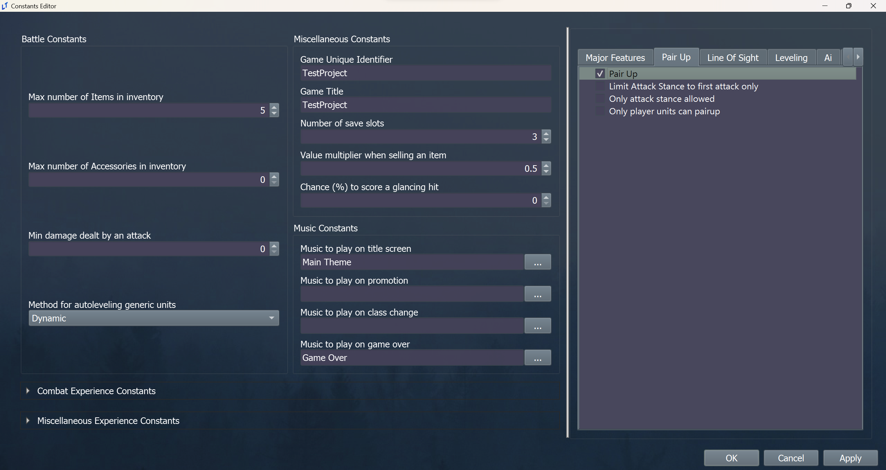
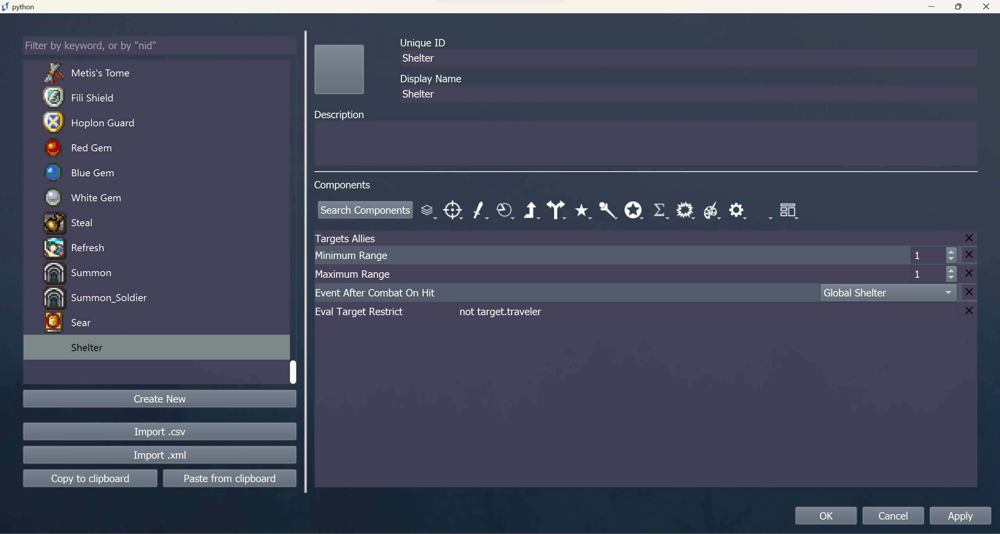
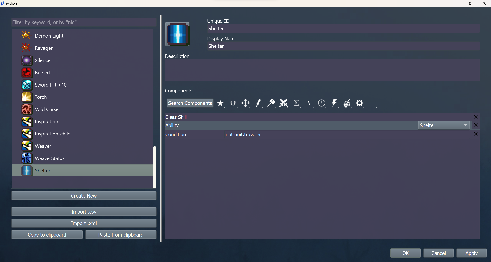

<a href="../../../index.html" class="icon icon-home">lt-maker</a>

Contents:

- <a href="../../home.html" class="reference internal">Lex Talionis
  Wiki</a>

Getting Started:

- <a href="../../getting_started/index.html"
  class="reference internal">Getting Started</a>

Editor Guides:

- <a href="../../editors/Editors-Overview.html"
  class="reference internal">Editors Overview</a>
- <a href="../../editors/index.html"
  class="reference internal">Editors</a>

Events:

- <a href="../../events/index.html" class="reference internal">Events</a>

Guides:

- <a href="../Guides-Overview.html" class="reference internal">Guides
  Overview</a>
- <a href="../index.html" class="reference internal">Guides</a>
  - <a href="../setup_tutorials/index.html"
    class="reference internal">Project Setup Tutorials</a>
  - <a href="../eventing_tutorials/index.html"
    class="reference internal">Eventing Tutorials</a>
  - <a href="index.html" class="reference internal">Skill and Item
    Tutorials</a>
    - <a href="Creating-Items.html" class="reference internal">0. Creating
      Items</a>
    - <a href="Direct-Passives.html" class="reference internal">1. Direct
      Passives - Hit +20, MAG +2 and Gamble</a>
    - <a href="Conditional-Passives-I.html" class="reference internal">2.
      Conditional Passives I - Lucky Seven, Odd Rhythm, Wrath and Quick
      Burn</a>
    - <a href="Conditional-Passives-II.html" class="reference internal">4.
      Conditional Passives II - Warding Blow, Rainlashslayer</a>
    - <a href="Conditional-Passives-III.html" class="reference internal">3.
      Conditional Passives III - Tomefaire, Axe Breaker and Wyrmbane</a>
    - <a href="Tile-Passives.html" class="reference internal">4. Tile Oriented
      Passives - Outdoor Fighter and Indoor Fighter</a>
    - <a href="Auras.html" class="reference internal">3. Auras - Hex, Bond and
      Focus</a>
    - <a href="Skill-Swap.html" class="reference internal">[System] Skill
      Swap</a>
    - <a href="Creating-Capture.html" class="reference internal">Capture
      skill</a>
    - <a href="Recruit-Skill.html" class="reference internal">Recruit
      Skill</a>
    - <a href="Summoning.html" class="reference internal">Summoning</a>
    - <a href="Shelter-Skill.html#" class="current reference internal">Shelter
      Skill</a>
      - <a href="Shelter-Skill.html#description"
        class="reference internal">Description</a>
      - <a href="Shelter-Skill.html#tutorial"
        class="reference internal">Tutorial</a>
    - <a href="Multi-Items.html" class="reference internal">Multi Items</a>
    - <a href="Nihil.html" class="reference internal">Nihil</a>

appendix:

- <a href="../../appendix/Text-Formatting-Commands.html"
  class="reference internal">Text Formatting Commands</a>
- <a href="../../appendix/Item-Component-Reference.html"
  class="reference internal">Item Component Dictionary</a>
- <a href="../../appendix/Skill-Component-Reference.html"
  class="reference internal">Skill Component Dictionary</a>
- <a href="../../appendix/Special-Variables.html"
  class="reference internal">Special Variables</a>
- <a href="../../appendix/Special-Tags.html"
  class="reference internal">Special Tags</a>
- <a href="../../appendix/trigger-reference.html"
  class="reference internal">Event Triggers</a>
- <a href="../../appendix/Random-Seed-Mechanics.html"
  class="reference internal">Random Seed Mechanics</a>
- <a href="../../appendix/FAQ.html" class="reference internal">Frequently
  Asked Questions</a>
- <a href="../../appendix/Contributing_to_the_LTWiki.html"
  class="reference internal">Contributing to the LTWiki</a>
- <a href="../../appendix/index.html" class="reference internal">Code
  Documentation</a>

[lt-maker](../../../index.html)

- 
- [Guides](../index.html)
- [Skill and Item Tutorials](index.html)
- Shelter Skill
- <a
  href="https://gitlab.com/rainlash/lt-maker/blob/master/docs/source/guides/skill_item_tutorials/Shelter-Skill.md"
  class="fa fa-gitlab">Edit on GitLab</a>

------------------------------------------------------------------------

# Shelter Skill<a href="Shelter-Skill.html#shelter-skill" class="headerlink"
title="Link to this heading"></a>

## Description<a href="Shelter-Skill.html#description" class="headerlink"
title="Link to this heading"></a>

I want a skill that:

- Grants an ability called **Shelter.**

- When the **ability** is used, an adjacent target becomes the user’s
  pair up partner

## Tutorial<a href="Shelter-Skill.html#tutorial" class="headerlink"
title="Link to this heading"></a>

**Step 1: Turn on pair up**

Open the constants editor and enable the pair up
constant.

**Step 2: Create an event that does the pairing**

Open the event editor and navigate to global events.
In a new event, enter the following code.

    move_unit;{unit2};{unit};normal;stack;no_follow
    pair_up;{unit2};{unit}

Do not set an event trigger. Name the event something like
“Shelter”.

**Step 3: Create a shelter item**

Open the item editor and create a shelter item.

While you can make the minimum and maximum range whatever
you want, this configuration will ensure a system that works like Fates
Shelter..

**Step 4: Create a shelter skill**

Open the skill editor and create a shelter skill.

Add a description and skill icon that you like.

**Conclusion**

You’re done! Test the skill in a debug map to try it
out.

<a href="Summoning.html" class="btn btn-neutral float-left"
accesskey="p" rel="prev" title="Summoning"> Previous</a>
<a href="Multi-Items.html" class="btn btn-neutral float-right"
accesskey="n" rel="next" title="Multi Items">Next </a>

------------------------------------------------------------------------

© Copyright 2024, rainlash.

Built with [Sphinx](https://www.sphinx-doc.org/) using a
[theme](https://github.com/readthedocs/sphinx_rtd_theme) provided by
[Read the Docs](https://readthedocs.org).

