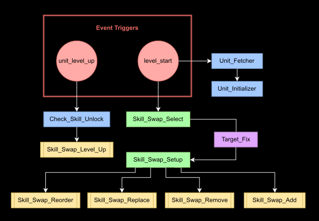
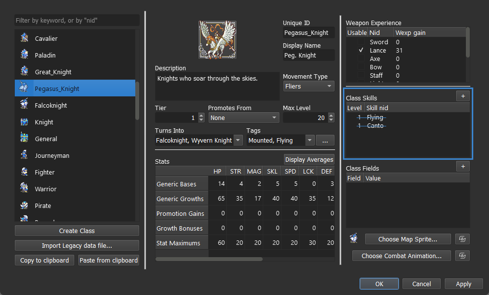
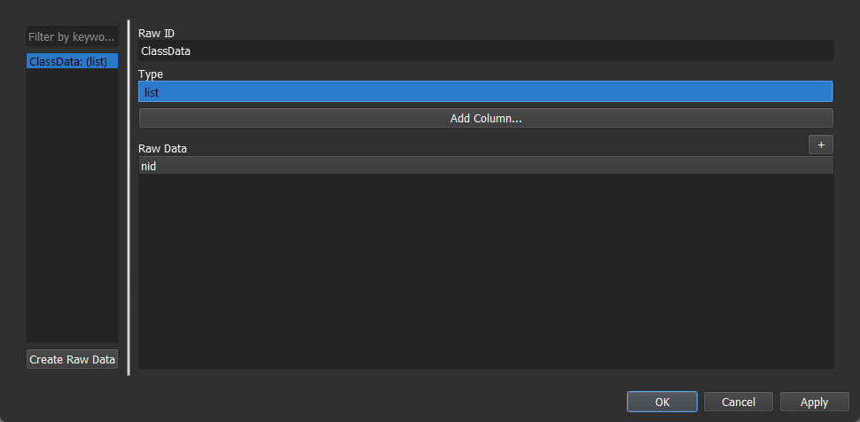
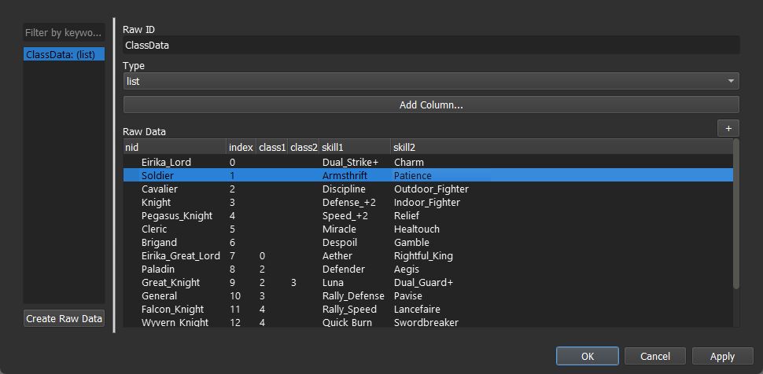
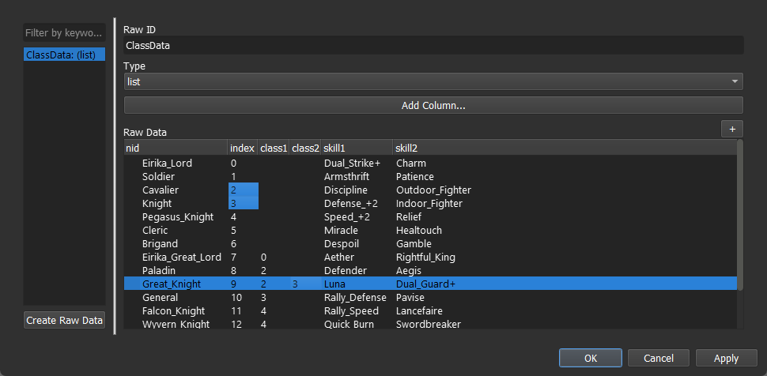
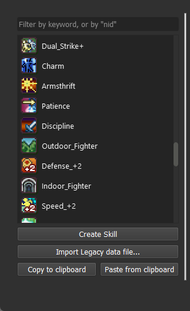
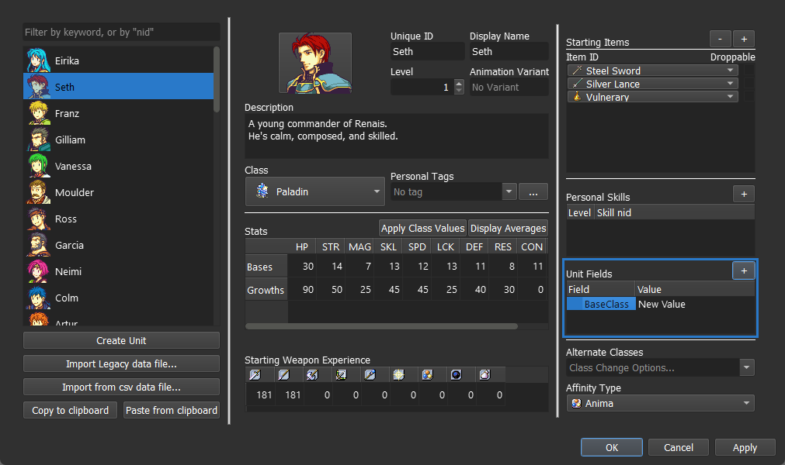
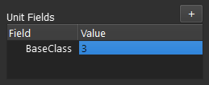
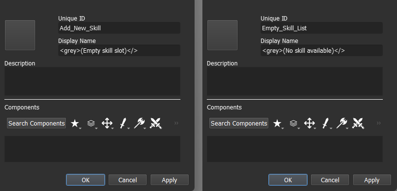

<a href="../../../index.html" class="icon icon-home">lt-maker</a>

Contents:

- <a href="../../home.html" class="reference internal">Lex Talionis
  Wiki</a>

Getting Started:

- <a href="../../getting_started/index.html"
  class="reference internal">Getting Started</a>

Editor Guides:

- <a href="../../editors/Editors-Overview.html"
  class="reference internal">Editors Overview</a>
- <a href="../../editors/index.html"
  class="reference internal">Editors</a>

Events:

- <a href="../../events/index.html" class="reference internal">Events</a>

Guides:

- <a href="../Guides-Overview.html" class="reference internal">Guides
  Overview</a>
- <a href="../index.html" class="reference internal">Guides</a>
  - <a href="../setup_tutorials/index.html"
    class="reference internal">Project Setup Tutorials</a>
  - <a href="../eventing_tutorials/index.html"
    class="reference internal">Eventing Tutorials</a>
  - <a href="index.html" class="reference internal">Skill and Item
    Tutorials</a>
    - <a href="Creating-Items.html" class="reference internal">0. Creating
      Items</a>
    - <a href="Direct-Passives.html" class="reference internal">1. Direct
      Passives - Hit +20, MAG +2 and Gamble</a>
    - <a href="Conditional-Passives-I.html" class="reference internal">2.
      Conditional Passives I - Lucky Seven, Odd Rhythm, Wrath and Quick
      Burn</a>
    - <a href="Conditional-Passives-II.html" class="reference internal">4.
      Conditional Passives II - Warding Blow, Rainlashslayer</a>
    - <a href="Conditional-Passives-III.html" class="reference internal">3.
      Conditional Passives III - Tomefaire, Axe Breaker and Wyrmbane</a>
    - <a href="Tile-Passives.html" class="reference internal">4. Tile Oriented
      Passives - Outdoor Fighter and Indoor Fighter</a>
    - <a href="Auras.html" class="reference internal">3. Auras - Hex, Bond and
      Focus</a>
    - <a href="Skill-Swap.html#" class="current reference internal">[System]
      Skill Swap</a>
      - <a href="Skill-Swap.html#required-editors-and-components"
        class="reference internal">Required editors and components</a>
      - <a href="Skill-Swap.html#understanding-the-problem"
        class="reference internal">Understanding the problem</a>
      - <a href="Skill-Swap.html#events-and-variables"
        class="reference internal">Events and Variables</a>
      - <a
        href="Skill-Swap.html#step-0-understanding-how-to-build-tuple-with-strings"
        class="reference internal">Step 0: Understanding how to build tuple with
        strings</a>
      - <a
        href="Skill-Swap.html#step-1-remove-all-skills-from-classes-and-units"
        class="reference internal">Step 1: Remove all skills from classes and
        units</a>
      - <a href="Skill-Swap.html#step-2-set-the-raw-data-table"
        class="reference internal">Step 2: Set the Raw Data table</a>
      - <a href="Skill-Swap.html#step-3-build-an-initializer-event"
        class="reference internal">Step 3: Build an Initializer event</a>
      - <a href="Skill-Swap.html#step-4-build-the-skill-unlock-event"
        class="reference internal">Step 4: Build the skill unlock event</a>
      - <a href="Skill-Swap.html#step-5-create-the-skill-swap-base"
        class="reference internal">Step 5: Create the Skill Swap base</a>
      - <a href="Skill-Swap.html#step-6-add-skill-swap-as-a-menu-option"
        class="reference internal">Step 6: Add skill swap as a menu option</a>
      - <a href="Skill-Swap.html#step-7-build-the-skill-swap-operations-event"
        class="reference internal">Step 7: Build the Skill Swap Operations
        event</a>
      - <a href="Skill-Swap.html#step-8-build-the-operations"
        class="reference internal">Step 8: Build the operations</a>
      - <a href="Skill-Swap.html#step-9-test-the-system"
        class="reference internal">Step 9: Test the system</a>
    - <a href="Creating-Capture.html" class="reference internal">Capture
      skill</a>
    - <a href="Recruit-Skill.html" class="reference internal">Recruit
      Skill</a>
    - <a href="Summoning.html" class="reference internal">Summoning</a>
    - <a href="Shelter-Skill.html" class="reference internal">Shelter
      Skill</a>
    - <a href="Multi-Items.html" class="reference internal">Multi Items</a>
    - <a href="Nihil.html" class="reference internal">Nihil</a>

appendix:

- <a href="../../appendix/Text-Formatting-Commands.html"
  class="reference internal">Text Formatting Commands</a>
- <a href="../../appendix/Item-Component-Reference.html"
  class="reference internal">Item Component Dictionary</a>
- <a href="../../appendix/Skill-Component-Reference.html"
  class="reference internal">Skill Component Dictionary</a>
- <a href="../../appendix/Special-Variables.html"
  class="reference internal">Special Variables</a>
- <a href="../../appendix/Special-Tags.html"
  class="reference internal">Special Tags</a>
- <a href="../../appendix/trigger-reference.html"
  class="reference internal">Event Triggers</a>
- <a href="../../appendix/Random-Seed-Mechanics.html"
  class="reference internal">Random Seed Mechanics</a>
- <a href="../../appendix/FAQ.html" class="reference internal">Frequently
  Asked Questions</a>
- <a href="../../appendix/Contributing_to_the_LTWiki.html"
  class="reference internal">Contributing to the LTWiki</a>
- <a href="../../appendix/index.html" class="reference internal">Code
  Documentation</a>

[lt-maker](../../../index.html)

- 
- [Guides](../index.html)
- [Skill and Item Tutorials](index.html)
- \[System\] Skill Swap
- <a
  href="https://gitlab.com/rainlash/lt-maker/blob/master/docs/source/guides/skill_item_tutorials/Skill-Swap.md"
  class="fa fa-gitlab">Edit on GitLab</a>

------------------------------------------------------------------------

`Originally`` ``written`` ``by`` ``Hillgarm.`` ``Last`` ``Updated`` ``2022-09-01`

`This`` ``has`` ``not`` ``been`` ``updated`` ``recently`` ``and`` ``has`` ``been`` ``reported`` ``as`` ``no`` ``longer`` ``working`` ``in`` ``current`` ``versions`` ``of`` ``the`` ``engine.`

# \[System\]( Skill Swap<a href="Skill-Swap.md#system-skill-swap" class="headerlink"
title="Link to this heading"></a>

Lex Talionis Event Editor offers enough power to build custom systems.
They can be quite complex, and this is the case with skill swap.

In this guide, we will be covering all the requirements to build your
own skill swap system using the tools available in the latest engine
build.

It is expected for the reader to have prior experience in the editors
and components used, as most of them will be glossed over due the amount
of steps required. Check the documentation and other guides to get learn
about these components.

We will be building the pieces in order of functionality, which may lead
to a few back and forward.

You will be able to get the code at the end of every major step, mostly
ready to use. It’s still recommended to go over every single step in
order to understand the mechanisms and how to adjust them to individual
project demands.

**Index**

- **Required editors and components**

- **Understanding the problem**

- **Events and Variables**

- **Step 0: Understanding how to build tuple with strings**

- **Step 1: Remove all skills from classes and units**

- **Step 2: Set the Raw Data table**

- **Step 3: Build an Initializer event**

  - Step 3.1: Create a level start manager

  - Step 3.2: Set the initialization condition

  - Step 3.3: Retrieve the current class Index value

  - Step 3.4: Retrieve the current class data

    - Step 3.4.1: Add self contained class exceptions

  - Step 3.5: Retrieve the previous class data

  - Step 3.6: Set both skill tuples

  - Step 3.7: Assign the equipped skills

  - **Complete script**

  - Step 3.7+: Add more learned skills

- **Step 4: Build the skill unlock event**

  - Step 4.1: Find the ClassData corresponding index

  - Step 4.2: Retrieve the skill based on the unit level

    - Step 4.2.1: Add self contained class exceptions

  - Step 4.3: Add the skill to the LearnedSkill tuple

  - Step 4.4: Auto equip the new skill

  - **Complete script**

- **Step 5: Create the Skill Swap base**

  - Step 5.1: Create Slot skills

  - Step 5.2: Process the equipped skills group

  - Step 5.3: Build the equipped skills menu

  - Step 5.4: Add a refresh mechanism

  - **Complete script**

- **Step 6: Add skill swap as a menu option**

- **Step 7: Build the Skill Swap Operations event**

  - **Complete script**

- **Step 8: Build the operations**

  - Step 8.A: Remove

  - Step 8.B: Reorder

  - Step 8.C: Add

  - Step 8.D: Replace

  - Step 8.E: Replace on level up

- **Step 9: Test the system**

## Required editors and components<a href="Skill-Swap.html#required-editors-and-components"
class="headerlink" title="Link to this heading"></a>

- Event:

  - Commands - game_var, set_unit_field, give_skill, remove_skill,
    trigger_script, for, if, table, choice

- Skills

- Raw Data

- Objects, Attributes and Methods:

  - unit - klass, get_field(‘{field}’),

  - game - get_data(‘{raw data}’)

## Understanding the problem<a href="Skill-Swap.html#understanding-the-problem" class="headerlink"
title="Link to this heading"></a>

Skill swap is a really simple concept but it takes a couple of minor
systems to work. We will use the standards set in Fire Emblem: Awakening
for this guide.

A way to describe skill swap is the follow:

    A system that grant units new individual skills by
    leveling up based on their current class, providing
    a wider array of options and personal customization
    for each unique class the unit ventures in, only
    limited by a maximum amount of simultaneously
    equipped skills.

Here are the basic directions:

- **\[SLOTS\]** Each unit can have up to a certain amount of skills, 5
  in this instance.

- **\[POLL\]** Every unit has its own individual collection of skills to
  pick from.

- **\[INHERIT\]** Units have to own all the skills corresponding to
  their current class level and promotion path.

- **\[UNLOCK\]** Skills are unlocked by leveling up

- **\[ASSIGN\]** Skills are automatically equipped if a slot is
  available when the unit is introduced or when it learns a new skill.

- **\[MANAGEMENT\]** The player can add, remove or swap skills at will.

These 6 points are the foundation of the system, and will have address
them from scratch. On a technical side, **Management** and **Slots**
can’t work with the native skill assignment system, so we will have to
built a new one as well.

In addition, the **Management** element also has 4 smaller components.

- **\[ADD\]** Equip a learned skills

- **\[REMOVE\]** Unequip a skill

- **\[SWAP\]** Replace an equipped skill with an unequipped one

- **\[REORDER\]** Move an equipped skill to the first slot.

Those operations require items to be added and removed from our
**poll**, and will give us two options.

1.  Make the equipped skills poll a completely different set from the
    learned skills poll. Operations will move items from one poll to the
    other.

2.  Make the equipped skills poll an assortment of the items from the
    learned skills poll. Operations will change the items within the
    equipped skills poll, but not the learned skills poll.

Here’s a visual example

<table class="docutils align-default">
<colgroup>
<col style="width: 25%" />
<col style="width: 25%" />
<col style="width: 25%" />
<col style="width: 25%" />
</colgroup>
<thead>
<tr class="header row-odd">
<th class="head"></th>
<th class="head">
Equipped 
skills
</th>
<th class="head">
Learned 
skills
</th>
<th class="head">
All 
skills
</th>
</tr>
</thead>
<tbody>
<tr class="odd row-even">
<td>
<strong>Option 1</strong>
</td>
<td>
Sol, 
Luna
</td>
<td>
Axefaire
</td>
<td>
Sol, 
Luna, 
Axefaire
</td>
</tr>
<tr class="even row-odd">
<td>
<strong>Option 2</strong>
</td>
<td>
Sol, 
Luna
</td>
<td>
<code
class="docutils literal notranslate">Sol</code>, 
<code
class="docutils literal notranslate">Luna</code>, 
Axefaire
</td>
<td>
Sol, 
Luna, 
Axefaire
</td>
</tr>
</tbody>
</table>

In a strict sense, option 1 is the most accurate. The only issue with it
is that if we fail to properly handle any addition or removal operation,
we may end up with duplicated skills or even delete it completely.

We will stick to the second one as it is easier to handle, less prone to
bugs and also allows some extra customization options such as forced
pair skills (it is a possibility but won’t be covered in this guide).

As such, the equipped skill poll will be a slice of the learned skill
poll, and we will filter those skills out whenever we need to.

## Events and Variables<a href="Skill-Swap.html#events-and-variables" class="headerlink"
title="Link to this heading"></a>

For this guide we will have a total of 12 events. One of them being
solely used as a conversion tool. It is possible to reduce them by half
but that can make things significantly more confusing. Our events will
have an underscore between words.

To save time, create all of the listed events in advance, preferably
using the same names, as those will be the ones listed in the guide.
Don’t forget to set their triggers as well. Those who have events listed
as triggers have to be set as **None**. All of them use the Global
level.

<table class="docutils align-default">
<colgroup>
<col style="width: 33%" />
<col style="width: 33%" />
<col style="width: 33%" />
</colgroup>
<thead>
<tr class="header row-odd">
<th class="head">
Event
</th>
<th class="head">
Type
</th>
<th class="head">
Trigger
</th>
</tr>
</thead>
<tbody>
<tr class="odd row-even">
<td>
<code
class="docutils literal notranslate">Unit_Fetcher</code>
</td>
<td>
Collector
</td>
<td>
level_start
</td>
</tr>
<tr class="even row-odd">
<td>
<code
class="docutils literal notranslate">Unit_Initializer</code>
</td>
<td>
Assignment
</td>
<td>
<code
class="docutils literal notranslate">Unit_Fetcher</code>
</td>
</tr>
<tr class="odd row-even">
<td>
<code
class="docutils literal notranslate">Check_Skill_Unlock</code>
</td>
<td>
Assignment
</td>
<td>
unit_level_up
</td>
</tr>
<tr class="even row-odd">
<td>
<code
class="docutils literal notranslate">Target_Fix</code>
</td>
<td>
Conversion
</td>
<td>
<code
class="docutils literal notranslate">Skill_Swap_Select</code>
</td>
</tr>
<tr class="odd row-even">
<td>
<code
class="docutils literal notranslate">Skill_Swap_Select</code>
</td>
<td>
Interface
</td>
<td>
<code
class="docutils literal notranslate">base;</code> or <code
class="docutils literal notranslate">prep;</code>
commands
</td>
</tr>
<tr class="even row-odd">
<td>
<code
class="docutils literal notranslate">Skill_Swap_Setup</code>
</td>
<td>
Interface
</td>
<td>
<code
class="docutils literal notranslate">Target_Fix</code>
</td>
</tr>
<tr class="odd row-even">
<td>
<code
class="docutils literal notranslate">Skill_Swap_Operations</code>
</td>
<td>
Interface
</td>
<td>
<code
class="docutils literal notranslate">Skill_Swap_Setup</code>
</td>
</tr>
<tr class="even row-odd">
<td>
<code
class="docutils literal notranslate">Skill_Swap_Add</code>, 
<code
class="docutils literal notranslate">Skill_Swap_Remove</code>, 
<code
class="docutils literal notranslate">Skill_Swap_Reorder</code>, 
<code
class="docutils literal notranslate">Skill_Swap_Replace</code>
</td>
<td>
Option
</td>
<td>
<code
class="docutils literal notranslate">Skill_Swap_Operations</code>
</td>
</tr>
<tr class="odd row-even">
<td>
<code
class="docutils literal notranslate">Skill_Swap_Level_Up</code>
</td>
<td>
Option
</td>
<td>
<code
class="docutils literal notranslate">Check_Skill_Unlock</code>
</td>
</tr>
</tbody>
</table>

Here’s a simple flowchart on how they will be connected.

As for our variables, most of them will be temporary data managers, and
all of them are mandatory. All of our variables names will be written in
upper case and have an underscore between words.

| Variable                                             | Type                          | Role                                                                                                                                         |
|------------------------------------------------------|-------------------------------|----------------------------------------------------------------------------------------------------------------------------------------------|
| \*`_SKILLS`                 | String/Tuple                  | Holds all the skills `EQUIPPED`/`LEARNED` by a given unit                                  |
| `AUX_`\*                    | Boolean, Integer, String, Nid | Temporary variable of a given type.                                                                                                          |
| `C_INDEX`                   | Integer                       | Same as `AUX_INT`, but only used to retrieve indexes.                                                               |
| `FECHED_`\*                 | Nid                           | Contains the Nid of the current `UNIT`/`CLASS`/`SKILL` in a loop. |
| `EXIT_SKILL_SWAP`           | Boolean                       | Allows skill swap to be refreshed or terminated.                                                                                             |
| `UNIT_EQUIPPED_SKILLS`      | Nid                           | Selected skill from the list of equipped skills, that will undergo a skill swap operation.                                                   |
| `UNIT_LEARNED_SKILLS`       | Nid                           | Selected skill from the list of learned skills, that will undergo either add or swap/replace operations.                                     |
| `EQUIP_NEW_SKILL`           | String                        | Yes/No option to swap an equipped skill with the last skill obtained when no equippable slot is available.                                   |
| `SKILL_SWAP_CAP` (Optional) | Integer                       | Defines the maximum number of equippable skill slots.                                                                                        |
| `SELECTED_UNIT`             | nid                           | Unit selected for skill swap.                                                                                                                |

Our field list will be significantly shorter. They won’t use underscore
and will start with a capital letter for each word split.

| Field                                     | Assign on Editor | Role                                                                                 |
|-------------------------------------------|------------------|--------------------------------------------------------------------------------------|
| `Initialized`    | No               | Checks if the unit went through initialization                                       |
| `BaseClass`      | Yes              | Contains the corresponding index of the base class. Exclusive to pre-promoted units. |
| `LearnedSkills`  | No               | Tuple containing all the skills learned by the unit.                                 |
| `EquippedSkills` | No               | Tuple containing all the currently equipped skills by the unit.                      |

## Step 0: Understanding how to build tuple with strings<a
href="Skill-Swap.html#step-0-understanding-how-to-build-tuple-with-strings"
class="headerlink" title="Link to this heading"></a>

Before we get into the guide itself, there’s a simple concept we need to
understand as it will be a core aspect of our systems. Tuples are a type
of array, which is a kind of variable that works as a item list. Instead
of having a single value, it holds multiple entries that carry their
individual values in itself, which is what exactly has slots work.

The event editor allows us to create tuples and retrieve tuple data but
doesn’t allow us to use any of the tuple related operations directly. As
such, we’re forced into converting them depending on what kind of
operation we need to perform. We’ll build them from strings, convert
them to tuple then later conver it strings, perform an operation through
strings, and convert it back to tuple.

Out of all the operations we will perform, adding a new entry is the
most essential. To do it through strings, we need to stack our elements
in a single auxiliary string while respecting the tuple building syntax,
like adding extra carts to a train.

    game_var;EXAMPLE;""
    game_var;EXAMPLE;"'First item',"
    game_var;EXAMPLE;"{v:EXAMPLE}" + "'Second item,'"
    game_var;EXAMPLE;"{v:EXAMPLE}" + "'Third item,'"

We will have to wipe our string before every stacking process to prevent
leftover data and, in some cases, set it to a specific value that will
be forced as the first item as well.

In this example, our string value should be:

    'First item','Second Item','Third item',

It can then be converted into a tuple, by calling itself in brackets.

    game_var;EXAMPLE;[{v:EXAMPLE}]

Every non-numeric item in it has to be contained in a pair of
apostrophes followed by a comma. Otherwise it will interpret the commas
as part a valid text element.

- *A tuple containing `'A','B','C'` has 3
  elements - \[A\], \[B\] and \[C\]*

- *A tuple containing `'A,B','C'` has 2
  elements - \[A, B\] and \[C\]*

## Step 1: Remove all skills from classes and units<a
href="Skill-Swap.html#step-1-remove-all-skills-from-classes-and-units"
class="headerlink" title="Link to this heading"></a>

As said before, the base system won’t work with the level of control
that we want. In order to use a custom assignment system we need to wipe
out all of the skills from the base system.

It is recommended to remove all of the skills, including Flying and
Canto, if you plan to have class change and class promotion in your
project.

## Step 2: Set the Raw Data table<a href="Skill-Swap.html#step-2-set-the-raw-data-table"
class="headerlink" title="Link to this heading"></a>

The first step to create or new skill assignment system is to build a
replacement for the data we deleted. We can do that by building a **raw
data** list, named `ClassData`.

Our table will use the following columns.

|          | nid             | class1 | class2           | skill1           | skill2             |
|----------|-----------------|--------|------------------|------------------|--------------------|
| **data** | \-              | \-     | previous class A | previous class B | 1st skill unlocked |
| **type** | class unique ID | int    | int or *blank*   | skill nid        | skill nid          |

For this guide, we will also add an index (starting at 0) column to make
it easier to read and assign class codes. You can add more columns to
fit your project needs, such as class3, skill4, etc.

Next, we need to fill the table with the data. Both **class fields**
will be exclusively used by advanced classes, filling each with the base
class it promotes from. If a class only has one promotion option, fill
the `class1` **field** and leave the other one
empty.

Here’s a quick example.

| index | nid         | class1 | class2 | skill1       | skill2         |
|-------|-------------|--------|--------|--------------|----------------|
| 0     | Lord        |        |        | DualStrike+  | Charm          |
| 1     | Cavalier    |        |        | Discipline   | OutdoorFighter |
| 2     | Knight      |        |        | Defense+2    | UbdoorFighter  |
| 3     | GreatLord   | 0      |        | Aether       | RightfulKing   |
| 4     | GreatKnight | 1      | 2      | Luna         | DualGuard+     |
| 5     | General     | 2      |        | RallyDefense | Pavise         |

The end result should look similar to this:

*This is a simplified table for the units that will
be used in the guide, with many skills and classes being replaced by
similar. You will run into errors if any data in it is missing or
incorrect. Be sure to check and test all of it once the system is
complete.*

Just to reinforce an important point. Both
`class1` and `class2`
must contain only numerical values, as those are indexes that reference
other classes in our table. For **Eirika_Great_Lord**, only
`class1` is used, and has the value 0 assigned,
which is **Eirika_Lord’s** index. Meanwhile, **Great_Knight** has two
possible classes to be promoted from, and 2 and 3 correspond to
**Cavalier** and **Knight** respectively.

Skills also have to be assigned with proper nid’s, as shown in the image
below.

This base concept can also be used to assign unit exclusive and/or
secret skills, though the specifics won’t be covered in this guide.

## Step 3: Build an Initializer event<a href="Skill-Swap.html#step-3-build-an-initializer-event"
class="headerlink" title="Link to this heading"></a>

Next. we will assign skills to our units. This is an issue on its own as
it has to be applied to both allies, enemies and neutral units when they
first appear in the game.

To do so, we will have to run an event that assign skills to our units
at the start of each chapter. This process, known as initialization,
only has to be done once per unit as running it multiple times will
cause the unit to gain duplicate copies of skills whenever it moves to a
new chapter.

### Step 3.1: Create a level start manager<a href="Skill-Swap.html#step-3-1-create-a-level-start-manager"
class="headerlink" title="Link to this heading"></a>

Our first is `Unit_Fetcher` and it has a really
simple, get all the units and cast the initialization event on them. As
said before, it has to happen at the start of every level - a **Global**
with **level_start** trigger.

We’ll use a `for-endf` loop with a
`trigger_script` inside, passing our unit data.

    for;FETCHED_UNIT;[u for u in game.level.units]
        trigger_script;Global Unit_Initializer;{FETCHED_UNIT}
    endf

This event is also the best place to set our skill slot size limiter.
For this guide, we will use them to keep our code consistent.

    game_var;SKILL_SWAP_CAP;5

*Using a variable as a limiter also offers more
flexibility when testing how many skills you want your game to have, and
it can also be used in creative ways such as forcing certain units to
have a different number of slots or even change the cap based on
difficulty or as an optional toggle.*

Once assembled, is should look like this:

    game_var;SKILL_SWAP_CAP;5
    for;FETCHED_UNIT;[u for u in game.level.units]
        trigger_script;Global Unit_Initializer;{FETCHED_UNIT}
    endf

### Step 3.2: Set the initialization condition<a href="Skill-Swap.html#step-3-2-set-the-initialization-condition"
class="headerlink" title="Link to this heading"></a>

Next, we need to build the `Unit_Initializer`
event that was called in the previous step. Since it can’t be run more
than once, we need to start with the lock.

This time, we’ll set a simple `if-end` checking
the field `Initialized`. All of our
initialization code will be set inside it.

    if;not unit.get_field('Initialized')
        #...
    end

One interesting aspect of fields is that the engine will interpret
fields that don’t exist as `False`, which saves
us a lot of work from setting up every single class and unit.

To complete our lock mechanism, we’ll set that field to true. In this
particular case, it will create the field as well.

    #...
    set_unit_field;{unit};Initialized;True

It is recommended to keep the field creation command at the very last
line of our condition so it won’t block the event if a critical error
occurs.

Once assembled, it will read like this:

    if;not unit.get_field('Initialized')
        #...
        set_unit_field;{unit};Initialized;True
    end

If the field doesn’t exist or has `False` as
its value, create the field and/or set it to
`True`.

We can go ahead and adding our three core collection variables that will
contain the skill data. Since those three will be used extensively, they
have to be set as empty strings to avoid any data leakage from previous
runs.

    game_var;LEARNED_SKILLS;""
    game_var;EQUIPPED_SKILLS;""
    game_var;AUX_SKILL;""

For now, we should have:

    if;not unit.get_field('Initialized')
        game_var;LEARNED_SKILLS;""
        game_var;EQUIPPED_SKILLS;""
        game_var;AUX_SKILL;""
        #...
        set_unit_field;{unit};Initialized;True
    end

### Step 3.3: Retrieve the current class Index value<a
href="Skill-Swap.html#step-3-3-retrieve-the-current-class-index-value"
class="headerlink" title="Link to this heading"></a>

The next step is more complex, we need to get all the data from our unit
class that was set to the `ClassData` table.

At first, we’ll stumble into three issues regarding the tools we have in
our disposal.

1.  There’s only one type of loop available

2.  This loop doesn’t return an index number

3.  We can only interact with a single field at time

The operation we want to do is **index** retrieval, which will allow us
to access every single field from that index row. We can build a work
around by adding a counter variable inside our loop, and eject right
when we find a matching pair.

Our **index** retrieval mechanism requires an **int** to act as a
counter itself and a **bool** to act as the lock, similar to what was
done in the initialization. Again, as this will be used by every single
unit, they have to be set at their minimum corresponding values.

    #...
    game_var;C_INDEX;0
    game_var;AUX_BOL;False

For the loop, the only reliable parameter available in our unit is
`klass`. Which is what we defined the
`ClassData` table
`nid` to be as well. We can add our counter to
it as well, which can be done with the native command
`inc_game_var`

    for;FETCHED_CLASS;game.get_data('ClassData')
        #...
        inc_game_var;C_INDEX
        #...
    endf

Note that the command `game.get_data()` is
targeting a bidimensional array (table) and has multiple fields to pick
from. That property will be used later. As the field wasn’t specified,
the engine will seek the `nid` field.

At this point, the counter will only return the total number of rows in
our table, so we need to set two locks one right next to each other. The
first one will check if the unit `klass`
matches an entry in our table, and then set the **bool** as
`True`. The second one will be added around our
counter as a negative, preventing it from happening while the **bool**
is `True`.

    #...
    if;"{FETCHED_CLASS}" == unit.klass
        game_var;AUX_BOL;True
    end
    if;not {v:AUX_BOL}
        inc_game_var;C_INDEX
    end

The engine will run the same order as the table follows. In the end,
`C_INDEX` will have hold the number
corresponding to that class position in the table. With the **index**
value in hands, we can access all of the fields from the unit class.

### Step 3.4: Retrieve the current class data<a href="Skill-Swap.html#step-3-4-retrieve-the-current-class-data"
class="headerlink" title="Link to this heading"></a>

It’s time to expand the command used in the **index** retrieval loop.
Other properties can be accessed with the following syntax:

    game.get_data('RawData')[{index}].field

A quick example with `class1` turns into:

    game.get_data('ClassData')[{C_INDEX}].class1

We can finally retrieve the first data for our unit. Since we will work
with lists, this data has to be stacked into a single place. This is
where we’ll need `LEARNED_SKILLS` and **tuple**
building.

    game_var;AUX_SKILL;game.get_data('ClassData')[{v:C_INDEX}].skill1
    game_var;LEARNED_SKILLS;"{v:LEARNED_SKILLS}" + "'{v:AUX_SKILL}',"

This covers the basics but classes have predefined skill unlock levels.
For awakening, they were set as:

|                 | Skill 1 level | Skill 2 level |
|-----------------|---------------|---------------|
| **Base**        | 1             | 10            |
| **Advancement** | 5             | 15            |

Let’s take our current class as a non-promoted. The first skill will
always be available so we just need to worry about restricting the
second one. A simple `if-end` would do.

    if;unit.level >= 10
        game_var;AUX_SKILL;game.get_data('ClassData')[{v:C_INDEX}].skill2
        game_var;LEARNED_SKILLS;"{v:LEARNED_SKILLS}" + "'{v:AUX_SKILL}',"
    end

Be sure that he condition is set as **greater or equal** (\>=).

That’s good enough for this tier but we need to cover the advancement as
well. One option would be to add individual conditions for each one of
them but we can use a more elegant solution by checking a common
pattern. Promoted classes level milestones are delayed by 5 levels when
compared to the base classes.

It is possible to create a formula for it if we use the class
`tier` value. Let’s store that value in
`AUX_INT`. We’ll retrieve it from the internal
database, within the class data.

To access it, we need to use the following syntax:

    {e:DB.classes.get('class nid').tier}

Here, `class`` ``nid`
will be replaced by `{e:unit.klass}`.

    game_var;AUX_INT;{e:DB.classes.get('{e:unit.klass}').tier}

This command lines is using an evaluation inside another evaluation.
This is required as the our data is being promptly converted into text,
and we need it to be retrieved first, otherwise it will seek the class
`unit.klass` **nid**.

For the formulas, they’re really simple. When the tier value increases
by 1 the level requirement increases by 5. Multiply those and add a base
number to get the corresponding values.

First skill:

    5 * {tier} - 5

Second skill:

    5 * {tier} + 5

While the first skill level isn’t totally accurate, the condition for it
will still be greater or equal. On practice, it won’t make any
difference.

Once we add the formula, it should look like this:

    if;unit.level >= 5 * {v:AUX_INT} - 5
        game_var;AUX_SKILL;game.get_data('ClassData')[{v:C_INDEX}].skill2
        game_var;LEARNED_SKILLS;"{v:LEARNED_SKILLS}" + "'{v:AUX_SKILL}',"
    end
    if;unit.level >= 5 * {v:AUX_INT} + 5
        game_var;AUX_SKILL;game.get_data('ClassData')[{v:C_INDEX}].skill2
        game_var;LEARNED_SKILLS;"{v:LEARNED_SKILLS}" + "'{v:AUX_SKILL}',"
    end

As a matter of preference and processing optimization, we’ll move the
second condition inside the first one. The whole block should look like
this:

    game_var;AUX_INT;{e:DB.classes.get('{e:unit.klass}').tier}
    if;unit.level >= 5 * {v:AUX_INT} - 5
        game_var;AUX_SKILL;game.get_data('ClassData')[{v:C_INDEX}].skill1
        game_var;LEARNED_SKILLS;"{v:LEARNED_SKILLS}" + "'{v:AUX_SKILL}',"
        if;unit.level >= 5 * {v:AUX_INT} + 5
            game_var;AUX_SKILL;game.get_data('ClassData')[{v:C_INDEX}].skill2
            game_var;LEARNED_SKILLS;"{v:LEARNED_SKILL}" + "'{v:AUX_SKILL}',"
        end
    end

#### Step 3.4.1: Add self contained class exceptions<a href="Skill-Swap.html#step-3-4-1-add-self-contained-class-exceptions"
class="headerlink" title="Link to this heading"></a>

Here is where we run into an annoying issue that isn’t exclusive to Fire
Emblem: Awakening but may not be part of your project.

There are a few classes that follow a different set of rules and they
can’t work with a standard formula. The first skill is granted at the
base class level but the second one is granted at the advanced level, 1
and 15 respectively.

The most effective way to address it is by expanding our second skill
condition, as those classes are categorized as unpromoted, but it is
easier to handle it by adding an additional conditional branch instead.

Our base condition for those classes would be:

    unit.klass in ('Bride', 'Dancer', 'Dread Fighter', 'Manakete', 'Taguel', 'Villager')

As this restriction is exclusive the the group second skill, the level
can be set manually.

    unit.klass in ('Bride', 'Dancer', 'Dread Fighter', 'Manakete', 'Taguel', 'Villager') and unit.level >= 15

Every single exception has to be checked first. We should have something
like:

    if;unit.level >= 5 * {v:AUX_INT} - 5
        game_var;AUX_SKILL;game.get_data('ClassData')[{v:C_INDEX}].skill1
        game_var;LEARNED_SKILLS;"{v:LEARNED_SKILLS}" + "'{v:AUX_SKILL}',"
        if;unit.klass in ('Bride', 'Dancer', 'Dread Fighter', 'Manakete', 'Taguel', 'Villager') and unit.level >= 15
            game_var;AUX_SKILL;game.get_data('ClassData')[{v:C_INDEX}].skill2
            game_var;LEARNED_SKILLS;"{v:LEARNED_SKILL}" + "'{v:AUX_SKILL}',"
        elif;unit.level >= 5 * {v:AUX_INT} + 5
            game_var;AUX_SKILL;game.get_data('ClassData')[{v:C_INDEX}].skill2
            game_var;LEARNED_SKILLS;"{v:LEARNED_SKILL}" + "'{v:AUX_SKILL}',"
        end
    end

### Step 3.5: Retrieve the previous class data<a href="Skill-Swap.html#step-3-5-retrieve-the-previous-class-data"
class="headerlink" title="Link to this heading"></a>

Here’s where we take the first visual compromise. In Fire Emblem
Awakening, pre-promoted units skills will be listed as if the unit was
leveled by the player. In short, base class skills appear first.

For now, we will ignore that aspect and focus on retrieving data from a
second class.

All of the key units have their base classes pre-determined, and that
information can only be set manually. Fortunately the editor can save us
a lot of work.

First, we go back to our raw data table and get the corresponding
**index**. We will use Seth as our example unit, as a base Great Knight
promoted from Knight.

Great Knight **index** is 9, promoted from indexes 2 and 3. The first
one is Cavalier and the Second one is Knight. For this exercise, we’ll
pretend he was promoted from Knight.

In the unit editor, we’ll add the field
`BaseClass` and set its value to Knight’s
index, 3.

Back to the event editor, we need to add a verifier for the
`tier` and **field**.

    game_var;AUX_INT;{e:DB.classes.get('{e:unit.klass}').tier}
    if;{v:AUX_INT} >= 2
        if; unit.get_field('BaseClass')
            game_var;AUX_INT;unit.get_field('BaseClass')
        else
            #...
        end
        #...
    end

At this point you may see a critical issue regarding this approach. It
will surely work as long as every one of our key units have the field
defined with a valid value. Which is the same as saying, if the unit is
a generic or a key unit that didn’t received such field, it won’t get
base class skills. A valid option if intended, but we should have some
sort of backup if not.

Our options would be

1.  Define every map encounters through events

2.  Use class1 as the default when a class isn’t specified

3.  Not assign base class skills

4.  Assign a class at random

At this point, you should be able to do 1 to 3 on your own by tinkering
with the previous steps. We’ll focus on the 4th then.

The easiest approach is by adding all of our possible class options to a
tuple and pick one of them at random. This new code will be deployed
inside the else branch.

Starting with a refresh.

    #...
    game_var;AUX_STR;""

And follow up with some stacking.

    if;game.get_data('ClassData')[{v:C_INDEX}].class1
        game_var;AUX_STR;"{v:AUX_STR}" + game.get_data('ClassData')[{v:C_INDEX}].class1 + ","
    end

*As all entries in the tuple are numbers, they won’t
require the use of apostrophes.*

We want to add that conditional statement to skip any potential empty
cell, as they can mess up our poll. This block can copied and pasted for
every single class slot the project uses, using the corresponding column
name (`class1`,
`class2`, `class3`,
…).

Next, we build the tuple, pick the random number based on our tuple size
and retrieve the value using the sorted index.

    game_var;AUX_STR;[{v:AUX_STR}]
    game_var;AUX_INT;game.get_random(0,len({v:AUX_STR})-1)
    game_var;AUX_INT;{v:AUX_STR}[{v:AUX_INT}]

The `len()` method will give use the last index
number +1, and that extra increment has to be corrected.

Our random picker should look something like this:

    if;game.get_data('ClassData')[{v:C_INDEX}].class1
        game_var;AUX_STR;"{v:AUX_STR}" + game.get_data('ClassData')[{v:C_INDEX}].class1 + ","
    end
    if;game.get_data('ClassData')[{v:C_INDEX}].class2
        game_var;AUX_STR;"{v:AUX_STR}" + game.get_data('ClassData')[{v:C_INDEX}].class2 + ","
    end
    game_var;AUX_STR;[{v:AUX_STR}]
    game_var;AUX_INT;game.get_random(0,len({v:AUX_STR})-1)
    game_var;AUX_INT;{v:AUX_STR}[{v:AUX_INT}]

Assembling it with the previous branch, we get the following:

    game_var;AUX_INT;{e:DB.classes.get('{e:unit.klass}').tier}
    if;{v:AUX_INT} >= 2
        if; unit.get_field('BaseClass')
            game_var;AUX_INT;unit.get_field('BaseClass')
        else
            if;game.get_data('ClassData')[{v:C_INDEX}].class1
                game_var;AUX_STR;"{v:AUX_STR}" + game.get_data('ClassData')[{v:C_INDEX}].class1 + ","
            end
            if;game.get_data('ClassData')[{v:C_INDEX}].class2
                game_var;AUX_STR;"{v:AUX_STR}" + game.get_data('ClassData')[{v:C_INDEX}].class2 + ","
            end
            game_var;AUX_STR;[{v:AUX_STR}]
            game_var;AUX_INT;game.get_random(0,len({v:AUX_STR})-1)
            game_var;AUX_INT;{v:AUX_STR}[{v:AUX_INT}]
        end
        #...
    end

That last empty space can be filled with the skill retrieval. Same
syntax as the previous step, but this time we won’t need any conditions.

    #...
    game_var;AUX_SKILL;game.get_data('ClassData')[{v:AUX_INT}].skill1
    game_var;LEARNED_SKILLS;"{v:LEARNED_SKILLS}" + "'{v:AUX_SKILL}',"
    game_var;AUX_SKILL;game.get_data('ClassData')[{v:AUX_INT}].skill2
    game_var;LEARNED_SKILLS;"{v:LEARNED_SKILLS}" + "'{v:AUX_SKILL}',"

At last, our code should look like this:

    game_var;AUX_INT;{e:DB.classes.get('{e:unit.klass}').tier}
    if;{v:AUX_INT} >= 2
        if;unit.get_field('BaseClass')
            game_var;AUX_INT;unit.get_field('BaseClass')
        else
            game_var;AUX_STR;""
            if;game.get_data('ClassData')[{v:C_INDEX}].class1
                game_var;AUX_STR;"{v:AUX_STR}" + game.get_data('ClassData')[{v:C_INDEX}].class1 + ","
            end
            if;game.get_data('ClassData')[{v:C_INDEX}].class2
                game_var;AUX_STR;"{v:AUX_STR}" + game.get_data('ClassData')[{v:C_INDEX}].class2 + ","
            end

            game_var;AUX_STR;[{v:AUX_STR}]
            game_var;AUX_INT;game.get_random(0,len({v:AUX_STR})-1)
            game_var;AUX_INT;{v:AUX_STR}[{v:AUX_INT}]
        end
        game_var;AUX_SKILL;game.get_data('ClassData')[{v:AUX_INT}].skill1
        game_var;LEARNED_SKILLS;"{v:LEARNED_SKILLS}" + "'{v:AUX_SKILL}',"
        game_var;AUX_SKILL;game.get_data('ClassData')[{v:AUX_INT}].skill2
        game_var;LEARNED_SKILLS;"{v:LEARNED_SKILLS}" + "'{v:AUX_SKILL}',"
    end

*This block only address for single promotion trees.
Extensive class tree will require more conditions, events and/or
loops.*

Bear in mind that this chunk of code has to come first to keep the skill
display order as a natural progression. The order should be the
following:

    if;not unit.get_field('Initialized')
        game_var;LEARNED_SKILLS;""
        game_var;EQUIPPED_SKILLS;""

        #<3.3>
        #<3.5>
        #<3.4>

        #...

        set_unit_field;{unit};Initialized;True
    end

*The three number codes within tags are replacing
the final code of their respective steps. This indicator will be used on
later steps as well.*

### Step 3.6: Set both skill tuples<a href="Skill-Swap.html#step-3-6-set-both-skill-tuples"
class="headerlink" title="Link to this heading"></a>

Next in the line is tuple building. Nothing new in here, except that
we’ll also set a value to `EQUIPPED_SKILLS`. In
this particular structure, it should be impossible for an unit to be
deployed with more than 4 equipped skills unlocked. That is the sole
reason we ignored `EQUIPPED_SKILLS` until now.
You may need to do a couple of adjustments if your game uses fewer slots
or more skills per class.

    #...
    game_var;EQUIPPED_SKILLS;"{v:LEARNED_SKILLS}"
    game_var;EQUIPPED_SKILLS;[{v:EQUIPPED_SKILLS}]
    game_var;LEARNED_SKILLS;[{v:LEARNED_SKILLS}]

The two first lines could be combined for optimization but we want to
have more room for test control, such as giving specific units or
classes extra skills. This is one of many good reasons to add a hard
block to our `EQUIPPED_SKILLS` poll.

As a tuple we can use the `len()` to count how
many indexes our tuple has and the
`[start`` ``index:end`` ``index]`
structure to trim it based on the indexes.

    if;len({v:EQUIPPED_SKILLS}) > {v:SKILL_SWAP_CAP}
        game_var;EQUIPPED_SKILLS;{v:EQUIPPED_SKILLS}[0:{v:SKILL_SWAP_CAP}]
    end

This will check if our tuple is above our limit and cut everything added
past our boundary.

At last, we pass the tuple information to our fields.

    set_unit_field;{unit};EquippedSkills;{v:EQUIPPED_SKILLS}
    set_unit_field;{unit};LearnedSkills;sorted({v:LEARNED_SKILLS})

The `sorted()` method will order all the tuple
elements alphabetically. A small quality of life aspect for browsing.

It should look like this:

    game_var;EQUIPPED_SKILLS;"{v:LEARNED_SKILLS}"
    game_var;EQUIPPED_SKILLS;[{v:EQUIPPED_SKILLS}]
    game_var;LEARNED_SKILLS;[{v:LEARNED_SKILLS}]

    if;len({v:EQUIPPED_SKILLS}) > {v:SKILL_SWAP_CAP}
        game_var;EQUIPPED_SKILLS;{v:EQUIPPED_SKILLS}[0:{v:SKILL_SWAP_CAP}]
    end

    set_unit_field;{unit};EquippedSkills;{v:EQUIPPED_SKILLS}
    set_unit_field;{unit};LearnedSkills;sorted({v:LEARNED_SKILLS})

### Step 3.7: Assign the equipped skills<a href="Skill-Swap.html#step-3-7-assign-the-equipped-skills"
class="headerlink" title="Link to this heading"></a>

Up to this point we only managed the data. If we were to play a test
chapter, none of the units would have any skills assigned.

We can run a simple loop to add the
`EQUIPPED_SKILLS`.

    for;FETCHED_SKILL;{v:EQUIPPED_SKILLS}
        give_skill;{unit};{FETCHED_SKILL};no_banner
    endf

### Complete script<a href="Skill-Swap.html#complete-script" class="headerlink"
title="Link to this heading"></a>

    if;not unit.get_field('Initialized')
        game_var;LEARNED_SKILLS;""
        game_var;EQUIPPED_SKILLS;""
        game_var;AUX_SKILL;""
        game_var;C_INDEX;0
        game_var;AUX_BOL;False

        #<3.3>
        for;FETCHED_CLASS;game.get_data('ClassData')
            if;"{FETCHED_CLASS}" == unit.klass
                game_var;AUX_BOL;True
            end
            if;not {v:AUX_BOL}
                inc_game_var;C_INDEX
            end
        endf

        #<3.5>
        game_var;AUX_INT;{e:DB.classes.get('{e:unit.klass}').tier}
        if;{v:AUX_INT} >= 2
            if;unit.get_field('BaseClass')
                game_var;AUX_INT;unit.get_field('BaseClass')
            else
                game_var;AUX_STR;""
                if;game.get_data('ClassData')[{v:C_INDEX}].class1
                    game_var;AUX_STR;"{v:AUX_STR}" + game.get_data('ClassData')[{v:C_INDEX}].class1 + ","
                end
                if;game.get_data('ClassData')[{v:C_INDEX}].class2
                    game_var;AUX_STR;"{v:AUX_STR}" + game.get_data('ClassData')[{v:C_INDEX}].class2 + ","
                end
                game_var;AUX_STR;[{v:AUX_STR}]
                game_var;AUX_INT;game.get_random(0,len({v:AUX_STR})-1)
                game_var;AUX_INT;{v:AUX_STR}[{v:AUX_INT}]
            end
            game_var;AUX_SKILL;game.get_data('ClassData')[{v:AUX_INT}].skill1
            game_var;LEARNED_SKILLS;"{v:LEARNED_SKILLS}" + "'{v:AUX_SKILL}',"
            game_var;AUX_SKILL;game.get_data('ClassData')[{v:AUX_INT}].skill2
            game_var;LEARNED_SKILLS;"{v:LEARNED_SKILLS}" + "'{v:AUX_SKILL}',"
        end

        #<3.4>
        game_var;AUX_INT;game.get_data('ClassData')
        if;unit.level >= 5 * {v:AUX_INT} - 5
            game_var;AUX_SKILL;game.get_data('ClassData')[{v:C_INDEX}].skill1
            game_var;LEARNED_SKILLS;"{v:LEARNED_SKILLS}" + "'{v:AUX_SKILL}',"
            if;unit.klass in ('Bride', 'Dancer', 'Dread Fighter', 'Manakete', 'Taguel', 'Villager') and unit.level >= 15
                game_var;AUX_SKILL;game.get_data('ClassData')[{v:C_INDEX}].skill2
                game_var;LEARNED_SKILLS;"{v:LEARNED_SKILL}" + "'{v:AUX_SKILL}',"
            elif;unit.level >= 5 * {v:AUX_INT} + 5
                game_var;AUX_SKILL;game.get_data('ClassData')[{v:C_INDEX}].skill2
                game_var;LEARNED_SKILLS;"{v:LEARNED_SKILL}" + "'{v:AUX_SKILL}',"
            end
        end

        #<3.6>
        game_var;EQUIPPED_SKILLS;"{v:LEARNED_SKILLS}"
        game_var;EQUIPPED_SKILLS;[{v:EQUIPPED_SKILLS}]
        game_var;LEARNED_SKILLS;[{v:LEARNED_SKILLS}]
        if;len({v:EQUIPPED_SKILLS}) > 5
            game_var;EQUIPPED_SKILLS;{v:EQUIPPED_SKILLS}[0:5]
        end
        set_unit_field;{unit};EquippedSkills;{v:EQUIPPED_SKILLS}
        set_unit_field;{unit};LearnedSkills;sorted({v:LEARNED_SKILLS})

        #<3.7>
        for;FETCHED_SKILL;{v:EQUIPPED_SKILLS}
            give_skill;{unit};{FETCHED_SKILL};no_banner
        endf

        set_unit_field;{unit};Initialized;True
    end

### Step 3.7+: Add more learned skills<a href="Skill-Swap.html#step-3-7-add-more-learned-skills"
class="headerlink" title="Link to this heading"></a>

To add more skills we just need to concatenate more items to our string
before the tuple conversion done in 3.6.

For this example we will be using **Seth** as our unit and also
**Trickster** as a class. Our skills will be Luna and Sol, but we won’t
add the the latter to the equipped skills poll.

    if;unit.nid == 'Seth' or unit.klass == 'Trickster'
        game_var;AUX_SKILL;"Luna"
        game_var;EQUIPPED_SKILLS;"{v:EQUIPPED_SKILLS}" + "'{v:AUX_SKILL}',"
        game_var;AUX_SKILL;"{v:AUX_SKILL}" + "Sol"
        game_var;LEARNED_SKILLS;"{v:LEARNED_SKILLS}" + "{v:AUX_SKILL},"
    end

*There’s also the option to only add skills to the
equipped poll, however these skills won’t be restored once removed or
swapped.*

You may run a test to check if the extra skill was applied correctly. Of
course, you won’t be able to see Sol in it until we build the UI.

## Step 4: Build the skill unlock event<a href="Skill-Swap.html#step-4-build-the-skill-unlock-event"
class="headerlink" title="Link to this heading"></a>

Initialization only takes care of the base setup, we still need to allow
our units to gain skills upon leveling or class change. Fortunately,
both can be done in the same event without any workaround.

It’s time to build the `Check_Skill_Unlock`
event. On a conceptual level, unlocking skills is a fragment of the
whole process of assigning skills based on the unit level. A lot of the
structures we used to build the initialization will be reused in here.

### Step 4.1: Find the ClassData corresponding index<a
href="Skill-Swap.html#step-4-1-find-the-classdata-corresponding-index"
class="headerlink" title="Link to this heading"></a>

Once again, the first step is to get the class index, just as we did in
3.3, along the `AUX_SKILL` reset. This time, we
will follow it up by retrieving the class
`tier` right away.

    game_var;AUX_SKILL;""
    game_var;C_INDEX;0
    game_var;AUX_BOL;False
    for;FETCHED_CLASS;game.get_data('ClassData')
        if;"{FETCHED_CLASS}" == unit.klass
            game_var;AUX_BOL;True
        end
        if;not {v:AUX_BOL}
            inc_game_var;C_INDEX
        end
    endf
    game_var;AUX_INT;{e:DB.classes.get('{e:unit.klass}').tier}

### Step 4.2: Retrieve the skill based on the unit level<a
href="Skill-Swap.html#step-4-2-retrieve-the-skill-based-on-the-unit-level"
class="headerlink" title="Link to this heading"></a>

Next, we have have to check if the unit has reached an unlock level and
retrieve the skill. Again, we will take a chunk of the code used in 3.4.

Here we have a crucial distinction to that variant. Our conditions have
to use **equal** (**==**) instead of **greater or equal** (**\>=**),
otherwise we will be flooded by duplicates.

Additionally, we’ll have to use the `max()`
command for our first skill. This command returns the highest value of
two numbers, we set one of them as 1 and it will cover for all base
classes.

    if;unit.level == max (1, 5 * {v:AUX_INT} - 5)
        game_var;AUX_SKILL;game.get_data('ClassData')[{v:C_INDEX}].skill1
    elif;unit.level = 5 * {v:AUX_INT} + 5
        game_var;AUX_SKILL;game.get_data('ClassData')[{v:C_INDEX}].skill2
    end

Following up, we need to be sure that our skill haven’t been learned
before moving on, which may happen depending on how the game is
structured. The condition is simple.

    if;'{v:AUX_SKILL}' not in unit.get_field('LearnedSkills')
        #...
    end

The only issue with this condition is that the engine won’t interpret
the empty value as a skill that doesn’t exist in the tuple, so we need
to correct that by checking if `{v:AUX_SKILL}`
has a value. Just patch the condition with
`{v:AUX_SKILL}`` ``and`` `
to fix it.

    if;{v:AUX_SKILL} and '{v:AUX_SKILL}' not in unit.get_field('LearnedSkills')
        #...
    end

All of our following code will be added inside that
`if-end` statement.

#### Step 4.2.1: Add self contained class exceptions<a href="Skill-Swap.html#step-4-2-1-add-self-contained-class-exceptions"
class="headerlink" title="Link to this heading"></a>

Same as 3.4.1, adapt the code to allow our exceptions.

    if;unit.level == max (1, 5 * {v:AUX_INT} - 5)
        game_var;AUX_SKILL;game.get_data('ClassData')[{v:C_INDEX}].skill1
    elif;unit.klass in ('Bride', 'Dancer', 'Dread Fighter', 'Manakete', 'Taguel', 'Villager') and unit.level == 15
        game_var;AUX_SKILL;game.get_data('ClassData')[{v:C_INDEX}].skill2
    elif;unit.level == 5 * {v:AUX_INT} + 5
        game_var;AUX_SKILL;game.get_data('ClassData')[{v:C_INDEX}].skill2
    end

### Step 4.3: Add the skill to the LearnedSkill tuple<a
href="Skill-Swap.html#step-4-3-add-the-skill-to-the-learnedskill-tuple"
class="headerlink" title="Link to this heading"></a>

It’s time to put the explanation from step 0 into practice. To do so, we
have to rely on `','.join("Expression")`, a
method that converts arrays into strings based on the input expression.

    game_var;LEARNED_SKILLS;','.join(s for s in unit.get_field('LearnedSkills')) + ",'{v:AUX_SKILL}'"

One issue with `','.join()` is that it will
return a direct string for each entry. If our tuple had
`'Sol',`` ``'Luna',`` ``'Astra'`
the output would be
`Sol,`` ``Luna,`` ``Astra`.
While that is handy, our string will become a tuple again once we add
the extra item and we need it to be properly formatted. Fortunately,
this can be easily addressed by adding the apostrophes around
`s`.

    game_var;LEARNED_SKILLS;','.join("'" + s + "'" for s in unit.get_field('LearnedSkills')) + ",'{v:AUX_SKILL}'"

Now that the entry was added, we convert it back.

    set_unit_field;{unit};LearnedSkills;sorted([{v:LEARNED_SKILLS}])

Since that string has no use past this point, it can be added along the
field update command.

### Step 4.4: Auto equip the new skill<a href="Skill-Swap.html#step-4-4-auto-equip-the-new-skill"
class="headerlink" title="Link to this heading"></a>

At last, we have to check if we to auto equip our skill if the unit has
any vacant slot. We will adjust the code used in 3.6, but this time
using the field directly.

    if;len(unit.get_field('EquippedSkills')) < {v:SKILL_SWAP_CAP}
        #...
    else
        #...
    end

Our previous block of code will be added inside the
`True` output branch, and we will follow it up
by assigning the skill to the unit.

    #...
    give_skill;{unit};{v:AUX_SKILL};

Of course, our `EquippedSkills` field has to be
updated as well, just like in 4.3.

    game_var;EQUIPPED_SKILLS;','.join("'" + s + "'" for s in unit.get_field('EquippedSkills')) + ",'{v:AUX_SKILL}'"
    set_unit_field;{unit};EquippedSkills;[{v:EQUIPPED_SKILLS}]

For the `False` side, we want to display an
message and a menu for the player to pick if it wants to equip the new
skill or not.

    alert;<blue>{e:unit.nid}</> learned <blue>{e:DB.skills.get('{v:AUX_SKILL}').name}</>;;{v:AUX_SKILL}

The `<blue></>` will format the message to
appear more similar to the default skill unlock message.

Next, we add our first menu using the `choice`
command, it will pass the options **Yes** and **No**.

    choice;EQUIP_NEW_SKILL;Equip the skill?;Yes,No

To access the player choice, we have to build comparing the retrieved
value to the used in our target option.

Here’s the syntax:

    if;'{choice variable}' == 'option text'
        #...
    end

Which turns into:

    if;'{v:EQUIP_NEW_SKILL}' == 'Yes'
        #...
    end

We can add a call for the event, though it will be one of the last
things built in this guide.

    if;'{v:EQUIP_NEW_SKILL}' == 'Yes'
        trigger_script;Skill_Swap_Level_Up (Global Skill_Swap_Level_Up);{unit}
    end

Our assembled code should look like this:

    if;len(unit.get_field('EquippedSkills')) < {v:SKILL_SWAP_CAP}
        give_skill;{unit};{v:AUX_SKILL};
        game_var;EQUIPPED_SKILLS;','.join("'" + s + "'" for s in unit.get_field('EquippedSkills')) + ",'{v:AUX_SKILL}'"
        set_unit_field;{unit};EquippedSkills;sorted([{v:EQUIPPED_SKILLS}])
    else
        alert;<blue>{e:unit.nid}</> learned <blue>{e:DB.skills.get('{v:AUX_SKILL}').name}</>;;{v:AUX_SKILL}
        choice;EQUIP_NEW_SKILL;Equip the skill?;Yes,No
        if;'{v:EQUIP_NEW_SKILL}' == 'Yes'
            trigger_script;Skill_Swap_Level_Up (Global Skill_Swap_Level_Up);{unit}
        end
    end

### Complete script<a href="Skill-Swap.html#id1" class="headerlink"
title="Link to this heading"></a>

    game_var;C_INDEX;0
    game_var;AUX_BOL;False
    game_var;AUX_SKILL;""

    #<4.1>
    for;FETCHED_CLASS;game.get_data('ClassData')
        if;"{FETCHED_CLASS}" == unit.klass
            game_var;AUX_BOL;True
        end
        if;not {v:AUX_BOL}
            inc_game_var;C_INDEX
        end
    endf
    game_var;AUX_INT;{e:DB.classes.get('{e:unit.klass}').tier}

    #<4.2>
    if;unit.level == max (1, 5 * {v:AUX_INT} - 5)
        game_var;AUX_SKILL;game.get_data('ClassData')[{v:C_INDEX}].skill1
    elif;unit.klass in ('Bride', 'Dancer', 'Dread Fighter', 'Manakete', 'Taguel', 'Villager') and unit.level == 15
        game_var;AUX_SKILL;game.get_data('ClassData')[{v:C_INDEX}].skill2
    elif;unit.level == 5 * {v:AUX_INT} + 5
        game_var;AUX_SKILL;game.get_data('ClassData')[{v:C_INDEX}].skill2
    end

    if;'{v:AUX_SKILL}' and '{v:AUX_SKILL}' not in unit.get_field('LearnedSkills')

        #<4.3>
        game_var;LEARNED_SKILLS;','.join("'" + s + "'" for s in unit.get_field('LearnedSkills')) + ",'{v:AUX_SKILL}'"
        set_unit_field;{unit};LearnedSkills;sorted([{v:LEARNED_SKILLS}])

        #<4.4>
        if;len(unit.get_field('EquippedSkills')) < {v:SKILL_SWAP_CAP}
            game_var;EQUIPPED_SKILLS;','.join("'" + s + "'" for s in unit.get_field('EquippedSkills')) + ",'{v:AUX_SKILL}'"
            set_unit_field;{unit};EquippedSkills;[{v:EQUIPPED_SKILLS}]
            give_skill;{unit};{v:AUX_SKILL};
        else
            alert_skill;<blue>{e:unit.nid}</> learned <blue>{e:DB.skills.get('{v:AUX_SKILL}').name}</>;;{v:AUX_SKILL}
            choice;EQUIP_NEW_SKILL;;Yes,No
            if;'{v:EQUIP_NEW_SKILL}' == 'Yes'
                trigger_script;Skill_Swap_Level_Up (Global Skill_Swap_Level_Up);{unit}
            end
        end

    end

## Step 5: Create the Skill Swap base<a href="Skill-Swap.html#step-5-create-the-skill-swap-base"
class="headerlink" title="Link to this heading"></a>

The backstage is complete, onto the UI. This time, it will be the
`Skill_Swap_Setup` event.

### Step 5.1: Create Slot skills<a href="Skill-Swap.html#step-5-1-create-slot-skills" class="headerlink"
title="Link to this heading"></a>

But before that, there’s also an extra requirement that haven’t been
addressed yet and it’s mostly a mix of technicality with some visual
benefits.

First, we have to understand a particular limitation regarding the
engine:

- In order for skills to be displayed in a list with their icon, the
  list can’t have anything that isn’t a skill

- If an unit has vacant slots, it needs a text to inform it in the list.

- If all of the learned skills are already equipped, the learned skill
  needs a text to inform it in the list.

This limitation applies to every single icon based list. Fortunately, it
can be done with a simple workaround using two skills with no components
nor icons.

The first skill will be named `Add_New_Skill`,
used for the equipped skills group, and the second one will be named
`Empty_Skill_List`, only to be used when all
the learned skills are equipped.

You may dismiss the `<grey></>` tag if you want
to, but it great visual indicator that our dummy skills aren’t real
skills.

### Step 5.2: Process the equipped skills group<a href="Skill-Swap.html#step-5-2-process-the-equipped-skills-group"
class="headerlink" title="Link to this heading"></a>

Back to `Skill_Swap_Setup`. Our equipped skill
list has to be displayed in a menu and doing so requires two key
processes. The first is a conversion from tuple to string, as the
`choice` only accepts the latter, and the
second is the addition of the dummy skill whenever the unit presents a
vacant slot.

Again, we’ll rely on `','.join()`.

    game_var;EQUIPPED_SKILLS;','.join([s for s in unit.get_field('EquippedSkills')])

For the vacant slot check, we have two distinct scenarios, one with no
skills equipped at all and the other with skills equipped and a vacant
slot.

Let’s start by checking the size of our
`EquippedSkills` field. As a tuple, we can use
`len()` again.

    if;len(unit.get_field('EquippedSkills')) == 0
        #...
    elif;len(unit.get_field('EquippedSkills')) < {v:SKILL_SWAP_CAP}
        #...
    end

As redundant as this may look, it is vital to split these conditions
when handing `choice` options.

Going for the bottom condition first. We want our option list to be
extended with our dummy skill.

    #...
    game_var;EQUIPPED_SKILLS;"{v:EQUIPPED_SKILLS},Add_New_Skill"

Meanwhile, the empty list will receive the dummy skill and nothing else.

    #...
    game_var;EQUIPPED_SKILLS;"Add_New_Skill"

Let’s run two quick tests to see the problem at hand. One with
`Luna,`` ``Sol` as our
skills, and the second one with no skill at all, both taking the
`<`` ``{v:SKILL_SWAP_CAP}`
approach.

<table class="docutils align-default">
<colgroup>
<col style="width: 25%" />
<col style="width: 25%" />
<col style="width: 25%" />
<col style="width: 25%" />
</colgroup>
<thead>
<tr class="header row-odd">
<th class="head">
Tuple
</th>
<th class="head">
Number of 
entries
</th>
<th class="head">
Output
</th>
<th class="head">
Corrected 
output
</th>
</tr>
</thead>
<tbody>
<tr class="odd row-even">
<td>
‘Luna’, 
’Sol’
</td>
<td>
2
</td>
<td>
Luna, 
Sol
</td>
<td>
Luna, 
Sol, 
(Empty skill slot)
</td>
</tr>
<tr class="even row-odd">
<td></td>
<td>
0
</td>
<td></td>
<td>
, 
(Empty skill slot)
</td>
</tr>
</tbody>
</table>

The engine can’t find a match for that case and will return an invalid
skill, which is why we need to enforce a hard reset.

For the learned skill poll we’ll also need a counter in case the list is
empty, but the idea is different. Since both polls should overlap, what
we need to know is if the `LearnedSkill` poll
is larger than the `EquippedSkill` poll, using
our dummy skill only when it isn’t.

    if;len(unit.get_field('LearnedSkills')) > len(unit.get_field('EquippedSkills'))
        #...
    else
        game_var;LEARNED_SKILLS;"Empty_Skill_List"
    end

To exclude the equipped skills, we can add a single condition into the
`','.join()` method.

    #...
    game_var;LEARNED_SKILLS;','.join([s for s in unit.get_field('LearnedSkills') if s not in unit.get_field('EquippedSkills')])

This will force the engine to compare if any entry exists in both
tuples, only adding those exclusive to the
`LearnedSkills` poll.

Once assembled, it should look like this:

    game_var;EQUIPPED_SKILLS;','.join([s for s in unit.get_field('EquippedSkills')])
    if;len(unit.get_field('EquippedSkills')) == 0
        game_var;EQUIPPED_SKILLS;"Add_New_Skill"
    elif;len(unit.get_field('EquippedSkills')) < {v:SKILL_SWAP_CAP}
        game_var;EQUIPPED_SKILLS;"{v:EQUIPPED_SKILLS},Add_New_Skill"
    end

    if;len(unit.get_field('LearnedSkills')) > len(unit.get_field('EquippedSkills'))
        game_var;LEARNED_SKILLS;','.join([s for s in unit.get_field('LearnedSkills') if s not in unit.get_field('EquippedSkills')])
    else
        game_var;LEARNED_SKILLS;"Empty_Skill_List"
    end

### Step 5.3: Build the equipped skills menu<a href="Skill-Swap.html#step-5-3-build-the-equipped-skills-menu"
class="headerlink" title="Link to this heading"></a>

At this point we will be able to check our background work in action.
Most of the work has already been done so we just need to set the menu.
Since it is an extensive line with a lot of colons, we’ll go over each
item for a short explanation.

    choice;UNIT_EQUIPPED_SKILLS;Equipped Skills;{v:EQUIPPED_SKILLS};100;vert;top_left;;Skill_Swap_Operations (Global Skill_Swap_Operations);type_skill;{v:SKILL_SWAP_CAP},1;backable

There are a couple of important elements to take a look at.

- `100` - Since our interface uses two windows
  it will look better if we have a static width.

- `top_left` - Again, we need to consider the
  second window, so we’re setting the first menu to be on the left.

- `Skill_Swap_Operations` - That’s our follow
  up event that will handle the operations, preemptively set.

- `type_skill` - This will allow our skills to
  be displayed with an icon next to them, which is the reason our dummy
  skills don’t have one.

- `{v:SKILL_SWAP_CAP},1` - A table size
  limiter, rows defined by our slot limiter and 1 column.

- `backable` - This flag allows the cancel
  button to be used to exit the menu.

That’s only equipped side of the our menu. For the learned skills we
will emulate the same visuals through a static
`table`. Bear in mind that the table has to
encapsulate the `choice` we just build.

    table;UNIT_RIGHT_SKILLS;{v:LEARNED_SKILLS};Learned Skills;{v:SKILL_SWAP_CAP},1;100;top_right;menu_bg_base (menu_bg_base);type_skill
    #...
    remove_table;UNIT_RIGHT_SKILLS

*The table name doesn’t matter.*

As you can see, some properties are identical to the menu and we have
`top_right` as a counterpart.

Our event should look like this:

    game_var;EXIT_SKILL_SWAP;True
    game_var;EQUIPPED_SKILLS;','.join([s for s in unit.get_field('EquippedSkills')])
    if;len(unit.get_field('EquippedSkills')) == 0
        game_var;EQUIPPED_SKILLS;"Add_New_Skill"
    elif;len(unit.get_field('EquippedSkills')) < {v:SKILL_SWAP_CAP}
        game_var;EQUIPPED_SKILLS;"{v:EQUIPPED_SKILLS},Add_New_Skill"
    end

    if;len(unit.get_field('LearnedSkills')) > len(unit.get_field('EquippedSkills'))
        game_var;LEARNED_SKILLS;','.join([s for s in unit.get_field('LearnedSkills') if s not in unit.get_field('EquippedSkills')])
    else
        game_var;LEARNED_SKILLS;"Empty_Skill_List"
    end

    table;UNIT_RIGHT_SKILLS;{v:LEARNED_SKILLS};Learned Skills;{v:SKILL_SWAP_CAP},1;100;top_right;menu_bg_base (menu_bg_base);type_skill
    choice;UNIT_EQUIPPED_SKILLS;Equipped Skills;{v:EQUIPPED_SKILLS};100;vert;top_left;;Skill_Swap_Operations (Global Skill_Swap_Operations);type_skill;{v:SKILL_SWAP_CAP},1;backable
    rmtable;UNIT_RIGHT_SKILLS

### Step 5.4: Add a refresh mechanism<a href="Skill-Swap.html#step-5-4-add-a-refresh-mechanism"
class="headerlink" title="Link to this heading"></a>

Another particular issue with skill swap is that our lists are both
persistent and dynamic. While we have a flag for the first, we don’t
have any tool that allows our choice list to be updated while active.
The only resource we have to update those lists is by resetting it once
it finishes any operation request.

Of course, this can lead to another issue, getting stuck in an infinite
looping. We can avoid that by adding a condition to our refresh
mechanism.

At the very top of the event script, we have to add our variable and its
value.

    game_var;EXIT_SKILL_SWAP;True

And at the very end, the condition with the opposite value.

    if;not {v:EXIT_SKILL_SWAP}
        #...
    end

As for the syntax, we’ll just use
`trigger_script`, but referencing the own
event.

    #...
    trigger_script;Skill_Swap_Setup (Global Skill_Swap_Setup)

As it is, the condition will be ignored every time. We will address that
at the start of `Skill_Swap_Setup`.

### Complete script<a href="Skill-Swap.html#id2" class="headerlink"
title="Link to this heading"></a>

    game_var;EXIT_SKILL_SWAP;True

    #<5.2>
    game_var;EQUIPPED_SKILLS;','.join([s for s in unit.get_field('EquippedSkills')])
    if;len(unit.get_field('EquippedSkills')) == 0
        game_var;EQUIPPED_SKILLS;"Add_New_Skill"
    elif;len(unit.get_field('EquippedSkills')) < {v:SKILL_SWAP_CAP}
        game_var;EQUIPPED_SKILLS;"{v:EQUIPPED_SKILLS},Add_New_Skill"
    end

    if;len(unit.get_field('LearnedSkills')) > len(unit.get_field('EquippedSkills'))
        game_var;LEARNED_SKILLS;','.join([s for s in unit.get_field('LearnedSkills') if s not in unit.get_field('EquippedSkills')])
    else
        game_var;LEARNED_SKILLS;"Empty_Skill_List"
    end

    #<5.3>
    game_var;EXIT_SKILL_SWAP;True
    game_var;EQUIPPED_SKILLS;','.join([s for s in unit.get_field('EquippedSkills')])
    if;len(unit.get_field('EquippedSkills')) == 0
        game_var;EQUIPPED_SKILLS;"Add_New_Skill"
    elif;len(unit.get_field('EquippedSkills')) < {v:SKILL_SWAP_CAP}
        game_var;EQUIPPED_SKILLS;"{v:EQUIPPED_SKILLS},Add_New_Skill"
    end

    if;len(unit.get_field('LearnedSkills')) > len(unit.get_field('EquippedSkills'))
        game_var;LEARNED_SKILLS;','.join([s for s in unit.get_field('LearnedSkills') if s not in unit.get_field('EquippedSkills')])
    else
        game_var;LEARNED_SKILLS;"Empty_Skill_List"
    end

    table;UNIT_RIGHT_SKILLS;{v:LEARNED_SKILLS};Learned Skills;{v:SKILL_SWAP_CAP},1;100;top_right;menu_bg_base (menu_bg_base);type_skill
    choice;UNIT_EQUIPPED_SKILLS;Equipped Skills;{v:EQUIPPED_SKILLS};100;vert;top_left;;Skill_Swap_Operations (Global Skill_Swap_Operations);type_skill;{v:SKILL_SWAP_CAP},1;backable
    rmtable;UNIT_RIGHT_SKILLS

    #<5.4>
    if;not {v:EXIT_SKILL_SWAP}
        trigger_script;Skill_Swap_Setup (Global Skill_Swap_Setup)
    end

## Step 6: Add skill swap as a menu option<a href="Skill-Swap.html#step-6-add-skill-swap-as-a-menu-option"
class="headerlink" title="Link to this heading"></a>

This time, we don’t have defined event. We’ll use any available event
that **wasn’t used in this guide** and has the
`level_start` trigger. If you don’t have any,
create a new one with any nameyou want.

In this external event, we’ll add Skill Swap as a menu option for base
and/or battle preparation, targeting the
`Skill_Swap_Select` event.

Both use a similar syntax structure.

    base;;;Skill Swap;;Skill_Swap_Select
    prep;;;Skill Swap;;Skill_Swap_Select

*Both commands will overwrite whichever previous
iteration of them by default. Be sure to adjust them for a merge in case
they are used elsewhere.*

The first field set is the option text, and the second one is the event
being called.

Now we have to build a menu for our units in
`Skill_Swap_Select`. For this guide, we’ll use
the DEBUG chapter and list the playable units in there. Just for fun,
we’ll add Bone as well.

Same as we did with the previous menu, fill a string with all the nids
and use it on the `choice` command.

    game_var;AUX_STR;"Eirika,Vanessa,Seth,Moulder,Bone"
    choice;SELECTED_UNIT;Swap skills from which unit?;{v:AUX_STR};73;;top_left;;Target_Fix (Global Target_Fix);type_unit;8,3;scroll_bar;persist;backable

A couple of things to notice:

- `type_unit` - This option adds each unit
  class animated sprite to the list as well. It is a great visual
  component but may cause a massive lag spike as well. A good
  alternative for it is `type_chibi`.

- `scroll_bar` - Enables a scroll bar. It’s a
  great tool to use whith menus that have fixed size.

- `persist` - Maintains the menu open until the
  user hits the back key. It can be used since the options won’t be
  changed during the operation.

Lastly, we add a single line of code to
`Target_Fix`.

    trigger_script;Skill_Swap_Setup (Global Skill_Swap_Setup);{v:SELECTED_UNIT}

As the name implies, we’re just fixing the event target so we can access
it directly as `unit`. You may use
`{v:SELECTED_UNIT}` but it can lead to a couple
of issues depending on how the event flux is defined.

We can finally see some of our work done by running a chapter. Try out
with different classes, tiers and unit levels to see if everything is
being listed as expected. You can also add extra skills by following
step 3.7+.

## Step 7: Build the Skill Swap Operations event<a href="Skill-Swap.html#step-7-build-the-skill-swap-operations-event"
class="headerlink" title="Link to this heading"></a>

Now that our base UI elements are either set or implemented, we have to
build `Skill_Swap_Operations`. This event will
act as a HUB between the previous menu and the real operations performed
in the system. Just as said in 5.4, we need to set the refresh control
variable to its opposite value.

    game_var;EXIT_SKILL_SWAP;False

Here’s how the trick work, as long as
`Skill_Swap_Operations` event happens, the
`Skill_Swap_Setup` event will be restarted.

Except for **Cancel**, all of our operations are dependent on context,
and will be available at the same time. We need to set an order for them
and cover all the scenarios where each option is eligible.

<table class="docutils align-default">
<colgroup>
<col style="width: 33%" />
<col style="width: 33%" />
<col style="width: 33%" />
</colgroup>
<thead>
<tr class="header row-odd">
<th class="head">
Option
</th>
<th class="head">
Equipped 
skill selected
</th>
<th class="head">
Learned 
skill poll 
size
</th>
</tr>
</thead>
<tbody>
<tr class="odd row-even">
<td>
<strong>Add</strong>
</td>
<td>
Dummy
</td>
<td>
Not zero
</td>
</tr>
<tr class="even row-odd">
<td>
<strong>Swap</strong>
</td>
<td>
Not dummy
</td>
<td>
Not zero
</td>
</tr>
<tr class="odd row-even">
<td>
<strong>Remove</strong>
</td>
<td>
Not dummy
</td>
<td>
Any
</td>
</tr>
<tr class="even row-odd">
<td>
<strong>Reorder</strong>
</td>
<td>
Last non-dummy skill 
in the list
</td>
<td>
Any
</td>
</tr>
</tbody>
</table>

*One important thing to have in mind is that order
we set our options will also be the order they will appear in the menu.
The options were listed from most to least used.*

Before getting into the filtering, let’s restart
`AUX_STR` so it can be safely used for our
string block.

    game_var;AUX_STR;""

Let’s take the two top options first. They share the same condition
regarding the status of learned skills but opposite binary on the
learned skill side. In both cases, we can check if value of
`LEARNED_SKILLS` and
`UNIT_EQUIPPED_SKILLS` match their
corresponding dummies.

    if;"{v:LEARNED_SKILLS}" != "Empty_Skill_List"
        if;"{v:UNIT_EQUIPPED_SKILLS}" == 'Add_New_Skill'
            #...
        else
            #...
        end
    end

As these may be the starting ends of a chain, we need to settle them as
the text for the first option followed by a comma.

It should look like this:

    if;"{v:LEARNED_SKILLS}" != "Empty_Skill_List"
        if;"{v:UNIT_EQUIPPED_SKILLS}" == 'Add_New_Skill'
            game_var;AUX_STR;"Add,"
        else
            game_var;AUX_STR;"Swap,"
        end
    end

For **Remove**, the only condition is that our skill is something other
than the dummy. This time, we’ll increment our variable with the
**Remove** option instead of setting it, as it can either be the first
option or come after **Swap**.

    if;"{v:UNIT_EQUIPPED_SKILLS}" != "Add_New_Skill"
        game_var;AUX_STR;"{v:AUX_STR}" + "Remove,"
        #...
    end

Same thing for **Reorder**, but checking if our selected skill isn’t the
first index in our tuple.

    #...
    if;unit.get_field('EquippedSkills')[0] != '{v:UNIT_EQUIPPED_SKILLS}'
        game_var;AUX_STR;"{v:AUX_STR}" + "Reorder,"
    end

We wrap it up by setting a **choice**, acting as our second menu.

    choice;SKILL_SWAP_OPERATION;;{v:AUX_STR}Cancel;40;backable

It may not look elegant but we have no need to add an extra line just to
stich **Cancel** in our menu. It will only be used in single particular
case where none of the other options is eligible.

The complete structure should look like this:

    game_var;AUX_STR;""
    if;"{v:LEARNED_SKILLS}" != "Empty_Skill_List"
        if;"{v:UNIT_EQUIPPED_SKILLS}" == 'Add_New_Skill'
            game_var;AUX_STR;"Add,"
        else
            game_var;AUX_STR;"Swap,"
        end
    end
    if;'{v:UNIT_EQUIPPED_SKILLS}' != 'Add_New_Skill'
        game_var;AUX_STR;"{v:AUX_STR}" + "Remove,"
        if;unit.get_field('EquippedSkills')[0] != '{v:UNIT_EQUIPPED_SKILLS}'
            game_var;AUX_STR;"{v:AUX_STR}" + "Reorder,"
        end
    end
    choice;SKILL_SWAP_OPERATION;;{v:AUX_STR}Cancel;40;backable

Following it, we can set our option branches checkers, and get them to
pre-emptively call each individual event:

    if;'{v:SKILL_SWAP_OPERATION}' == 'Remove'
        trigger_script;Skill_Swap_Remove (Global Skill_Swap_Remove);
    elif;'{v:SKILL_SWAP_OPERATION}' == 'Reorder'
        trigger_script;Skill_Swap_Reorder (Global Skill_Swap_Reorder);
    elif;'{v:SKILL_SWAP_OPERATION}' == 'Add'
        trigger_script;Skill_Swap_Add (Global Skill_Swap_Add);{unit}
    elif;'{v:SKILL_SWAP_OPERATION}' == 'Swap'
        trigger_script;Skill_Swap_Replace (Global Skill_Swap_Replace);
    end

### Complete script<a href="Skill-Swap.html#id3" class="headerlink"
title="Link to this heading"></a>

    game_var;EXIT_SKILL_SWAP;False
    game_var;AUX_STR;""
    if;"{v:LEARNED_SKILLS}" != "Empty_Skill_List"
        if;"{v:UNIT_EQUIPPED_SKILLS}" == 'Add_New_Skill'
            game_var;AUX_STR;"Add,"
        else
            game_var;AUX_STR;"Swap,"
        end
    end
    if;'{v:UNIT_EQUIPPED_SKILLS}' != 'Add_New_Skill'
        game_var;AUX_STR;"{v:AUX_STR}" + "Remove,"
        if;unit.get_field('EquippedSkills')[0] != "{v:AUX_SKILL}"
            game_var;AUX_STR;"{v:AUX_STR}" + "Reorder,"
        end
    end

    choice;SKILL_SWAP_OPERATION;;{v:AUX_STR}Cancel;40;backable

    if;'{v:SKILL_SWAP_OPERATION}' == 'Remove'
        trigger_script;Skill_Swap_Remove (Global Skill_Swap_Remove);
    elif;'{v:SKILL_SWAP_OPERATION}' == 'Reorder'
        trigger_script;Skill_Swap_Reorder (Global Skill_Swap_Reorder);
    elif;'{v:SKILL_SWAP_OPERATION}' == 'Add'
        trigger_script;Skill_Swap_Add (Global Skill_Swap_Add);{unit}
    elif;'{v:SKILL_SWAP_OPERATION}' == 'Swap'
        trigger_script;Skill_Swap_Replace (Global Skill_Swap_Replace);
    end

## Step 8: Build the operations<a href="Skill-Swap.html#step-8-build-the-operations" class="headerlink"
title="Link to this heading"></a>

At this point you may do them in whichever order you want, however they
are ordered by complexity. They also share lines of code and those won’t
be explained past the first occurence.

All of the operations will use `EquippedSkills`
tuple. Retrieving its value, then changing one of the indexes, and end
with an update with the corrected data.

Remember, every single option below has to be done in its respective
named event. Check the table of contents or the previous step to get
their names correctly if you haven’t created them already.

### Step 8.A: Remove<a href="Skill-Swap.html#step-8-a-remove" class="headerlink"
title="Link to this heading"></a>

Goal is simple, check which of the skills in our tuple is the one
selected, then build a new tuple without it. We must start by emptying
`AUX_STR`.

Next, we check which index in `EquippedSkills`
matches our skill. Since we’re building the tuple again, we want to
check the `False` output and stack that
information in our string.

    for;FETCHED_SKILL;unit.get_field('EquippedSkills')
        if;'{FETCHED_SKILL}' != '{v:UNIT_EQUIPPED_SKILLS}'
            game_var;AUX_STR;"{v:AUX_STR}" + "'{FETCHED_SKILL}',"
        end
    endf

All that is left to do is remove the skill from the unit and update the
field with the new tuple data.

    remove_skill;{unit};{v:UNIT_EQUIPPED_SKILLS}
    set_unit_field;{unit};EquippedSkills;[{v:AUX_STR}]

The end result should be:

    game_var;AUX_STR;""
    for;FETCHED_SKILL;unit.get_field('EquippedSkills')
        if;'{FETCHED_SKILL}' != '{v:UNIT_EQUIPPED_SKILLS}'
            game_var;AUX_STR;"{v:AUX_STR}" + "'{FETCHED_SKILL}',"
        end
    endf
    remove_skill;{unit};{v:UNIT_EQUIPPED_SKILLS}
    set_unit_field;{unit};EquippedSkills;[{v:AUX_STR}]

### Step 8.B: Reorder<a href="Skill-Swap.html#step-8-b-reorder" class="headerlink"
title="Link to this heading"></a>

**Reorder** is almost identical to remove. We’ll only change the first
line to set the selected skill as `AUX_STR`’s
value.

    game_var;AUX_STR;"'{v:UNIT_EQUIPPED_SKILLS}',"

By doing this, the new tuple will start with the selected skill data as
index 0. So we just need to remove original entry.

We can copy the remaining structure of 8.A, and delete the line that
removes our selected skill. The skill is being kept after all.

    for;FETCHED_SKILL;unit.get_field('EquippedSkills')
        if;'{FETCHED_SKILL}' != '{v:UNIT_EQUIPPED_SKILLS}'
            game_var;AUX_STR;"{v:AUX_STR}" + "'{FETCHED_SKILL}',"
        end
    endf

    `remove_skill;{unit};{v:UNIT_EQUIPPED_SKILLS}`

    set_unit_field;{unit};EquippedSkills;[{v:AUX_STR}]

The end result should be:

    game_var;AUX_STR;"'{v:UNIT_EQUIPPED_SKILLS}',"
    for;FETCHED_SKILL;unit.get_field('EquippedSkills')
        if;'{FETCHED_SKILL}' != '{v:UNIT_EQUIPPED_SKILLS}'
            game_var;AUX_STR;"{v:AUX_STR}" + "'{FETCHED_SKILL}',"
        end
    endf
    set_unit_field;{unit};EquippedSkills;[{v:AUX_STR}]

### Step 8.C: Add<a href="Skill-Swap.html#step-8-c-add" class="headerlink"
title="Link to this heading"></a>

This time, we’ll need to access our right panel. Turns out, we can’t as
that is a static information window.

The workaround for this is building a menu using the exact same
properties to cover it completely.

    choice;UNIT_LEARNED_SKILLS;Learned Skills;{v:LEARNED_SKILLS};100;vert;top_right;;;type_skill;{v:SKILL_SWAP_CAP},1;scroll_bar;backable

The selected skill can be added directly to our unit.

    give_skill;{unit};{v:UNIT_LEARNED_SKILLS}

And then to our tuple. As usual, we will have to convert it into a
string, then add our new skill, and convert it back into a tuple. This
time, it can be done directly into the
`','.join()` method.

    game_var;LIST_STRING;','.join(["'" + s + "'" for s in unit.get_field('EquippedSkills')]) + ",'{v:UNIT_LEARNED_SKILLS}'"

There’s still the possibility, even if marginal, that a player may
remove all of the equipped skills first, which can lead to a major error
in our system.

It can be patched by checking the tuple size first, and take the
selected skill directly as the new tuple value. We can save a bit of
trouble by copying the value from
`UNIT_LEARNED_SKILLS` into a string with the
proper formatting.

    if;len(unit.get_field('EquippedSkills')) > 0
        game_var;AUX_STR;",'{v:AUX_UNIT_LEARNED_SKILLS}'"
    else
        game_var;AUX_STR;"'{v:AUX_UNIT_LEARNED_SKILLS}'"
    end
    #...

Of course, this means we have to fix the previous line with the string
in mind. and move it past the previous condition.

    #...
    game_var;AUX_STR;','.join("'" + s + "'" for s in unit.get_field('EquippedSkills')) + "{v:AUX_STR}"

The last thing we have to do is to address the
`backable` set on our
`choice` command. When the menu is cancelled,
the variable `UNIT_LEARNED_SKILLS` will still
“BACK” as its new value, which isn’t a valid skill. We have to
encapsulate all of the code below the `choice`
command.

    if;'{v:UNIT_LEARNED_SKILLS}' != 'BACK'
        #...
    end

Last, we have to update the field.

The end result should be:

    choice;UNIT_LEARNED_SKILLS;Learned Skills;{v:LEARNED_SKILLS};100;vert;top_right;;;type_skill;{v:SKILL_SWAP_CAP},1;scroll_bar;backable
    if;'{v:UNIT_LEARNED_SKILLS}' != 'BACK'
        give_skill;{unit};{v:UNIT_LEARNED_SKILLS}
        if;len(unit.get_field('EquippedSkills')) > 0
            game_var;AUX_STR;",'{v:AUX_UNIT_LEARNED_SKILLS}'"
        else
            game_var;AUX_STR;"'{v:AUX_UNIT_LEARNED_SKILLS}'"
        end
        game_var;AUX_STR;','.join("'" + s + "'" for s in unit.get_field('EquippedSkills')) + "{v:AUX_STR}"
        set_unit_field;{unit};EquippedSkills;[{v:AUX_STR}]
    end

### Step 8.D: Replace<a href="Skill-Swap.html#step-8-d-replace" class="headerlink"
title="Link to this heading"></a>

In theory, **Replace** should be a direct combination of **Add** and
**Remove**, but there is more to do if you really want to commit to the
idea of slots. In this case, skill being added has to be displayed in
the same position as the one that was removed.

We’ll start by taking the pieces that work from those two elements. From
**Add**, we’ll take the menu structure and “BACK” condition, from
**Remove** we take the `AUX_STR` reset and the
field loop.

    choice;UNIT_LEARNED_SKILLS;Learned Skills;{v:LEARNED_SKILLS};100;vert;top_right;;;type_skill;{v:SKILL_SWAP_CAP},1;scroll_bar;backable
    if;'{v:UNIT_LEARNED_SKILLS}' != 'BACK'
        game_var;AUX_STR;""
        for;FETCHED_SKILL;unit.get_field('EquippedSkills')
            #...
        endf
    end

For our bit of original code, we want to check which slot our equipped
skills is in.

    if;'{FETCHED_SKILL}' == '{v:UNIT_EQUIPPED_SKILLS}'
        #...
    else
        #...
    end

Let’s address the `else` branch first. When it
comes to the engine side, the skills are displayed in the order they
were added to the unit. This means that to manipulate that visual
aspect, we need to remove all of the skills and add them again.

We’ll do just that and start building our tuple as well.

    #...
    game_var;AUX_STR;"{v:AUX_STR}" + "'{FETCHED_SKILL}',"
    remove_skill;{unit};{FETCHED_SKILL};no_banner
    give_skill;{unit};{FETCHED_SKILL};no_banner

This chunk of code can be copied onto the
`True` output side, replacing
`FETCHED_SKILL` with the corresponding
variables.

    #...
    game_var;AUX_STR;"{v:AUX_STR}" + "'{v:UNIT_LEARNED_SKILLS}',"
    remove_skill;{unit};{v:UNIT_EQUIPPED_SKILLS}
    give_skill;{unit};{v:UNIT_LEARNED_SKILLS}

*Here we’re letting the engine use the default
alerts for both skill commands, you may use
`no_banner` to suppress it or even add a custom
alert if you want to.*

At last, we update the field.

The end result should be something like:

    choice;UNIT_LEARNED_SKILLS;Learned Skills;{v:LEARNED_SKILLS};100;vert;top_right;;;type_skill;{v:SKILL_SWAP_CAP},1;scroll_bar;backable
    if;'{v:UNIT_LEARNED_SKILLS}' != 'BACK'
        game_var;AUX_STR;""
        for;FETCHED_SKILL;unit.get_field('EquippedSkills')
            if;'{FETCHED_SKILL}' == '{v:UNIT_EQUIPPED_SKILLS}'
                game_var;AUX_STR;"{v:AUX_STR}" + "'{v:UNIT_LEARNED_SKILLS}',"
                remove_skill;{unit};{v:UNIT_EQUIPPED_SKILLS}
                give_skill;{unit};{v:UNIT_LEARNED_SKILLS}
            else
                game_var;AUX_STR;"{v:AUX_STR}" + "'{FETCHED_SKILL}',"
                remove_skill;{unit};{FETCHED_SKILL};no_banner
                give_skill;{unit};{FETCHED_SKILL};no_banner
            end
        endf
        set_unit_field;{unit};EquippedSkills;[{v:AUX_STR}]
    end

### Step 8.E: Replace on level up<a href="Skill-Swap.html#step-8-e-replace-on-level-up"
class="headerlink" title="Link to this heading"></a>

Here we’ll use an event that was being called in 4.4,
`Skill_Swap_Level_Up`. It will be the one
triggered when a skill is unlocked but the unit lacks available slots to
auto-equip it.

This event is almost an identical copy of replace, with the only
difference being the menu, which will be the one used in
`Skill_Swap_Setup`. Copy the whole code from
8.D for now.

Next, we’ll add two lines of code from 5.2, the first will be added to
the top of our event script, and the other will replace a counterpart
from 8.D.

The one being added is the line that builds the string for or menu, no
adjustment is required.

    game_var;EQUIPPED_SKILLS;','.join(s for s in unit.get_field('EquippedSkills'))

Then, we will replace `choice` command with the
one from 5.2. We need to change the title and remove the associated
event. None of the processing done in 5.2 is needed here as this menu
will always be full.

From this:

    choice;UNIT_EQUIPPED_SKILLS;Equipped Skills;{v:EQUIPPED_SKILLS};100;vert;top_left;;Skill_Swap_Operations (Global Skill_Swap_Operations);type_skill;

To this:

    choice;UNIT_EQUIPPED_SKILLS;Replace skill?;{v:EQUIPPED_SKILLS};100;vert;top_left;;;type_skill;

At last, replace `UNIT_LEARNED_SKILLS` with
`AUX_SKILL`. It still contains the data
retrieved at `Check_Skill_Unlock`.

The end result should be something like:

    game_var;EQUIPPED_SKILLS;','.join(s for s in unit.get_field('EquippedSkills'))
    choice;UNIT_EQUIPPED_SKILLS;Replace skill?;{v:EQUIPPED_SKILLS};100;vert;top_left;;;type_skill;backable
    if;'{v:UNIT_EQUIPPED_SKILLS}' != 'BACK'
        game_var;AUX_STR;""
        for;FETCHED_SKILL;unit.get_field('EquippedSkills')
            if;'{FETCHED_SKILL}' == '{v:UNIT_EQUIPPED_SKILLS}'
                game_var;AUX_STR;"{v:AUX_STR}" + "'{FETCHED_SKILL}',"
                remove_skill;{unit};{v:UNIT_EQUIPPED_SKILLS}
                give_skill;{unit};{v:AUX_SKILL}
            else
                game_var;AUX_STR;"{v:AUX_STR}" + "'{FETCHED_SKILL}',"
                remove_skill;{unit};{FETCHED_SKILL};no_banner
                give_skill;{unit};{FETCHED_SKILL};no_banner
            end
        endf
        set_unit_field;{unit};EquippedSkills;[{v:AUX_STR}]
    end

And now we have the whole system working. Bear in mind that this version
of ‘replace on level up’ isn’t asking for the confirmation on the
action. Users may replace skills by accident if they go too fast.

This extra piece can be built using things covered in this guide, so
take it as a challenge if you care for this particular scenario.

## Step 9: Test the system<a href="Skill-Swap.html#step-9-test-the-system" class="headerlink"
title="Link to this heading"></a>

Congratulations, you have successfully build a skill swap system using
the event editor. You can now test all the interactions and thinker with
it to fill your needs.

<a href="Auras.html" class="btn btn-neutral float-left" accesskey="p"
rel="prev" title="3. Auras - Hex, Bond and Focus"> Previous</a>
<a href="Creating-Capture.html" class="btn btn-neutral float-right"
accesskey="n" rel="next" title="Capture skill">Next </a>

------------------------------------------------------------------------

© Copyright 2024, rainlash.

Built with [Sphinx](https://www.sphinx-doc.org/) using a
[theme](https://github.com/readthedocs/sphinx_rtd_theme) provided by
[Read the Docs](https://readthedocs.org).

