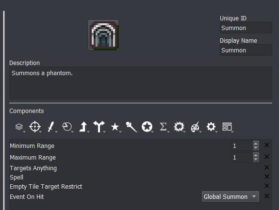
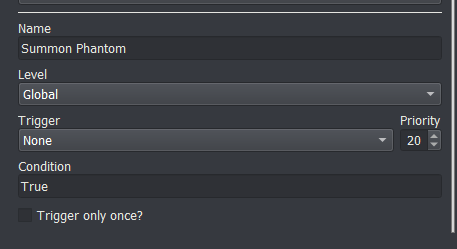
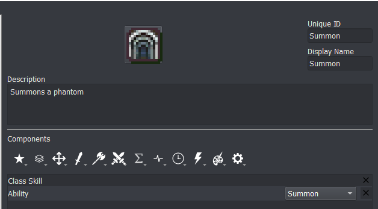

<a href="../../../index.html" class="icon icon-home">lt-maker</a>

Contents:

- <a href="../../home.html" class="reference internal">Lex Talionis
  Wiki</a>

Getting Started:

- <a href="../../getting_started/index.html"
  class="reference internal">Getting Started</a>

Editor Guides:

- <a href="../../editors/Editors-Overview.html"
  class="reference internal">Editors Overview</a>
- <a href="../../editors/index.html"
  class="reference internal">Editors</a>

Events:

- <a href="../../events/index.html" class="reference internal">Events</a>

Guides:

- <a href="../Guides-Overview.html" class="reference internal">Guides
  Overview</a>
- <a href="../index.html" class="reference internal">Guides</a>
  - <a href="../setup_tutorials/index.html"
    class="reference internal">Project Setup Tutorials</a>
  - <a href="../eventing_tutorials/index.html"
    class="reference internal">Eventing Tutorials</a>
  - <a href="index.html" class="reference internal">Skill and Item
    Tutorials</a>
    - <a href="Creating-Items.html" class="reference internal">0. Creating
      Items</a>
    - <a href="Direct-Passives.html" class="reference internal">1. Direct
      Passives - Hit +20, MAG +2 and Gamble</a>
    - <a href="Conditional-Passives-I.html" class="reference internal">2.
      Conditional Passives I - Lucky Seven, Odd Rhythm, Wrath and Quick
      Burn</a>
    - <a href="Conditional-Passives-II.html" class="reference internal">4.
      Conditional Passives II - Warding Blow, Rainlashslayer</a>
    - <a href="Conditional-Passives-III.html" class="reference internal">3.
      Conditional Passives III - Tomefaire, Axe Breaker and Wyrmbane</a>
    - <a href="Tile-Passives.html" class="reference internal">4. Tile Oriented
      Passives - Outdoor Fighter and Indoor Fighter</a>
    - <a href="Auras.html" class="reference internal">3. Auras - Hex, Bond and
      Focus</a>
    - <a href="Skill-Swap.html" class="reference internal">[System] Skill
      Swap</a>
    - <a href="Creating-Capture.html" class="reference internal">Capture
      skill</a>
    - <a href="Recruit-Skill.html" class="reference internal">Recruit
      Skill</a>
    - <a href="Summoning.html#"
      class="current reference internal">Summoning</a>
      - <a href="Summoning.html#summoning-a-generic-phantom"
        class="reference internal">Summoning a generic phantom</a>
      - <a href="Summoning.html#summoning-multiple-generics-echoes-style"
        class="reference internal">Summoning multiple generics
        (Echoes-style)</a>
      - <a href="Summoning.html#summoning-as-an-ability"
        class="reference internal">Summoning as an ability</a>
    - <a href="Shelter-Skill.html" class="reference internal">Shelter
      Skill</a>
    - <a href="Multi-Items.html" class="reference internal">Multi Items</a>
    - <a href="Nihil.html" class="reference internal">Nihil</a>

appendix:

- <a href="../../appendix/Text-Formatting-Commands.html"
  class="reference internal">Text Formatting Commands</a>
- <a href="../../appendix/Item-Component-Reference.html"
  class="reference internal">Item Component Dictionary</a>
- <a href="../../appendix/Skill-Component-Reference.html"
  class="reference internal">Skill Component Dictionary</a>
- <a href="../../appendix/Special-Variables.html"
  class="reference internal">Special Variables</a>
- <a href="../../appendix/Special-Tags.html"
  class="reference internal">Special Tags</a>
- <a href="../../appendix/trigger-reference.html"
  class="reference internal">Event Triggers</a>
- <a href="../../appendix/Random-Seed-Mechanics.html"
  class="reference internal">Random Seed Mechanics</a>
- <a href="../../appendix/FAQ.html" class="reference internal">Frequently
  Asked Questions</a>
- <a href="../../appendix/Contributing_to_the_LTWiki.html"
  class="reference internal">Contributing to the LTWiki</a>
- <a href="../../appendix/index.html" class="reference internal">Code
  Documentation</a>

[lt-maker](../../../index.html)

- 
- [Guides](../index.html)
- [Skill and Item Tutorials](index.html)
- Summoning
- <a
  href="https://gitlab.com/rainlash/lt-maker/blob/master/docs/source/guides/skill_item_tutorials/Summoning.md"
  class="fa fa-gitlab">Edit on GitLab</a>

------------------------------------------------------------------------

# Summoning<a href="Summoning.html#summoning" class="headerlink"
title="Link to this heading"></a>

*last updated 2022-04-28*

## Summoning a generic phantom<a href="Summoning.html#summoning-a-generic-phantom" class="headerlink"
title="Link to this heading"></a>

Items can call an event when they hit using the *Event on Hit*
component. Assign this component to the item you want to do the
summoning. For summoning a generic phantom, you’ll want to make sure the
item targets an empty space using the *Empty Tile Target Restrict*
component.

    # Phantom will always be the same level as the summoner
    if;game.get_unit('phantom')
        resurrect;phantom
        remove_unit;phantom;warp
        autolevel_to;phantom;{eval:unit.level}
    else
        make_generic;phantom;Fighter;{eval:unit.level};player
    end
    add_unit;phantom;{eval:target_pos};warp
    wait;200

Assingn the *Event on Hit* component to a global event that creates a
generic unit and places it on the map. If the unit already exists, you
can just resurrect the unit (in case the unit is dead) and then remove
the unit from the map and place it back on the field at the correct
position `{position}`.

If you have multiple summoners who each have a personal phantom, you can
give each one a unique nid instead of
`phantom`.

## Summoning multiple generics (Echoes-style)<a href="Summoning.html#summoning-multiple-generics-echoes-style"
class="headerlink" title="Link to this heading"></a>

This is done very similarly to summoning a single phantom. The event
itself just summons multiple new generics around the user
`{user}`. For this event, the soldiers are on
the ally team.

    make_generic;;Soldier;1;other;Pursue
    add_unit;{unit};{position};warp;closest
    make_generic;;Soldier;1;other;Pursue
    add_unit;{unit};{position};warp;closest
    make_generic;;Soldier;1;other;Pursue
    add_unit;{unit};{position};warp;closest
    make_generic;;Soldier;1;other;Pursue
    add_unit;{unit};{position};warp;closest
    wait;200

## Summoning as an ability<a href="Summoning.html#summoning-as-an-ability" class="headerlink"
title="Link to this heading"></a>

You can turn any item into an ability that a skill grants very easily.

Just add the *Ability* component to the skill!

<a href="Recruit-Skill.html" class="btn btn-neutral float-left"
accesskey="p" rel="prev" title="Recruit Skill"> Previous</a>
<a href="Shelter-Skill.html" class="btn btn-neutral float-right"
accesskey="n" rel="next" title="Shelter Skill">Next </a>

------------------------------------------------------------------------

© Copyright 2024, rainlash.

Built with [Sphinx](https://www.sphinx-doc.org/) using a
[theme](https://github.com/readthedocs/sphinx_rtd_theme) provided by
[Read the Docs](https://readthedocs.org).

