

<a href="../../../index.html" class="icon icon-home">lt-maker</a>

Contents:

- <a href="../../home.html" class="reference internal">Lex Talionis
  Wiki</a>

Getting Started:

- <a href="../../getting_started/index.html"
  class="reference internal">Getting Started</a>

Editor Guides:

- <a href="../../editors/Editors-Overview.html"
  class="reference internal">Editors Overview</a>
- <a href="../../editors/index.html"
  class="reference internal">Editors</a>

Events:

- <a href="../../events/index.html" class="reference internal">Events</a>

Guides:

- <a href="../Guides-Overview.html" class="reference internal">Guides
  Overview</a>
- <a href="../index.html" class="reference internal">Guides</a>
  - <a href="../setup_tutorials/index.html"
    class="reference internal">Project Setup Tutorials</a>
  - <a href="../eventing_tutorials/index.html"
    class="reference internal">Eventing Tutorials</a>
  - <a href="index.html" class="reference internal">Skill and Item
    Tutorials</a>
    - <a href="Creating-Items.html" class="reference internal">0. Creating
      Items</a>
    - <a href="Direct-Passives.html" class="reference internal">1. Direct
      Passives - Hit +20, MAG +2 and Gamble</a>
    - <a href="Conditional-Passives-I.html" class="reference internal">2.
      Conditional Passives I - Lucky Seven, Odd Rhythm, Wrath and Quick
      Burn</a>
    - <a href="Conditional-Passives-II.html" class="reference internal">4.
      Conditional Passives II - Warding Blow, Rainlashslayer</a>
    - <a href="Conditional-Passives-III.html" class="reference internal">3.
      Conditional Passives III - Tomefaire, Axe Breaker and Wyrmbane</a>
    - <a href="Tile-Passives.html#" class="current reference internal">4. Tile
      Oriented Passives - Outdoor Fighter and Indoor Fighter</a>
      - <a href="Tile-Passives.html#required-editors-and-components"
        class="reference internal">Required editors and components</a>
      - <a href="Tile-Passives.html#skill-descriptions"
        class="reference internal">Skill descriptions</a>
      - <a href="Tile-Passives.html#step-1-check-the-terrains-in-your-project"
        class="reference internal">Step 1: Check the Terrains in your
        project</a>
      - <a href="Tile-Passives.html#step-2-create-a-class-skill"
        class="reference internal">Step 2: Create a Class Skill</a>
      - <a href="Tile-Passives.html#step-3-add-the-combat-components"
        class="reference internal">Step 3: Add the Combat Components</a>
      - <a href="Tile-Passives.html#step-4-add-and-set-the-condition-component"
        class="reference internal">Step 4: Add and set the Condition
        component</a>
      - <a href="Tile-Passives.html#step-5-test-the-stat-alterations-in-game"
        class="reference internal">Step 5: Test the stat alterations in-game</a>
    - <a href="Auras.html" class="reference internal">3. Auras - Hex, Bond and
      Focus</a>
    - <a href="Skill-Swap.html" class="reference internal">[System] Skill
      Swap</a>
    - <a href="Creating-Capture.html" class="reference internal">Capture
      skill</a>
    - <a href="Recruit-Skill.html" class="reference internal">Recruit
      Skill</a>
    - <a href="Summoning.html" class="reference internal">Summoning</a>
    - <a href="Shelter-Skill.html" class="reference internal">Shelter
      Skill</a>
    - <a href="Multi-Items.html" class="reference internal">Multi Items</a>
    - <a href="Nihil.html" class="reference internal">Nihil</a>

appendix:

- <a href="../../appendix/Text-Formatting-Commands.html"
  class="reference internal">Text Formatting Commands</a>
- <a href="../../appendix/Item-Component-Reference.html"
  class="reference internal">Item Component Dictionary</a>
- <a href="../../appendix/Skill-Component-Reference.html"
  class="reference internal">Skill Component Dictionary</a>
- <a href="../../appendix/Special-Variables.html"
  class="reference internal">Special Variables</a>
- <a href="../../appendix/Special-Tags.html"
  class="reference internal">Special Tags</a>
- <a href="../../appendix/trigger-reference.html"
  class="reference internal">Event Triggers</a>
- <a href="../../appendix/Random-Seed-Mechanics.html"
  class="reference internal">Random Seed Mechanics</a>
- <a href="../../appendix/FAQ.html" class="reference internal">Frequently
  Asked Questions</a>
- <a href="../../appendix/Contributing_to_the_LTWiki.html"
  class="reference internal">Contributing to the LTWiki</a>
- <a href="../../appendix/index.html" class="reference internal">Code
  Documentation</a>

[lt-maker](../../../index.html)

- 
- [Guides](../index.html)
- [Skill and Item Tutorials](index.html)
- 4\. Tile Oriented Passives - Outdoor Fighter and Indoor Fighter
- <a
  href="https://gitlab.com/rainlash/lt-maker/blob/master/docs/source/guides/skill_item_tutorials/Tile-Passives.md"
  class="fa fa-gitlab">Edit on GitLab</a>

------------------------------------------------------------------------

`Originally`` ``written`` ``by`` ``Hillgarm.`` ``Last`` ``Updated`` ``2022-09-01`

# 4. Tile Oriented Passives - Outdoor Fighter and Indoor Fighter<a
href="Tile-Passives.html#tile-oriented-passives-outdoor-fighter-and-indoor-fighter"
class="headerlink" title="Link to this heading"></a>

In this guide we will be building what might be the most exquisite, and
fairly limited, kind of skill. Despite that, the principles behind it
can be used to create a pletora of interesting skills if properly
explored and implemented.

There won’t be any split step for this guide as the two skills are
direct opposites.

**INDEX**

- **Required editors and components**

- **Skill descriptions**

- **Step 1: Check the Terrains in your project**

  - Step 1.1: Check the maps

- **Step 2: Create a Class Skill**

- **Step 3: Add the Combat Components**

- **Step 4: Add and set the Condition component**

- **Step 5: Test the stat alterations in-game**

## Required editors and components<a href="Tile-Passives.html#required-editors-and-components"
class="headerlink" title="Link to this heading"></a>

- Skills:

  - Attribute components - Class Skills

  - Combat components - Avoid and Hit

  - Advanced components - Condition

- Classes

- Objects, Attributes and Methods:

  - unit - **position**

  - game - **tilemap**

  - **tilemap - get_terrain({coordinates})**

## Skill descriptions<a href="Tile-Passives.html#skill-descriptions" class="headerlink"
title="Link to this heading"></a>

- **Indoor Fighter** - Hit/Avoid +10 while indoors.

- **Outdoor Fighter** - Hit/Avoid +10 while outdoors.

## Step 1: Check the Terrains in your project<a href="Tile-Passives.html#step-1-check-the-terrains-in-your-project"
class="headerlink" title="Link to this heading"></a>

We need to write down all the **Unique IDs** for each terrain that will
be used in our skill. It will be completely arbitrary based on what you
will take as indoors or outdoors.

If you haven’t changed any of the default project **terrain**, there
shouldn’t be much to do in this step. The complete list will be
available at a later sub-step but it is recommended to take a look so
you can know how to adapt it to other skills and how to fix in case you
add any new **terrain**.

The **Terrain Editor** can be found within the **Edit Menu**.

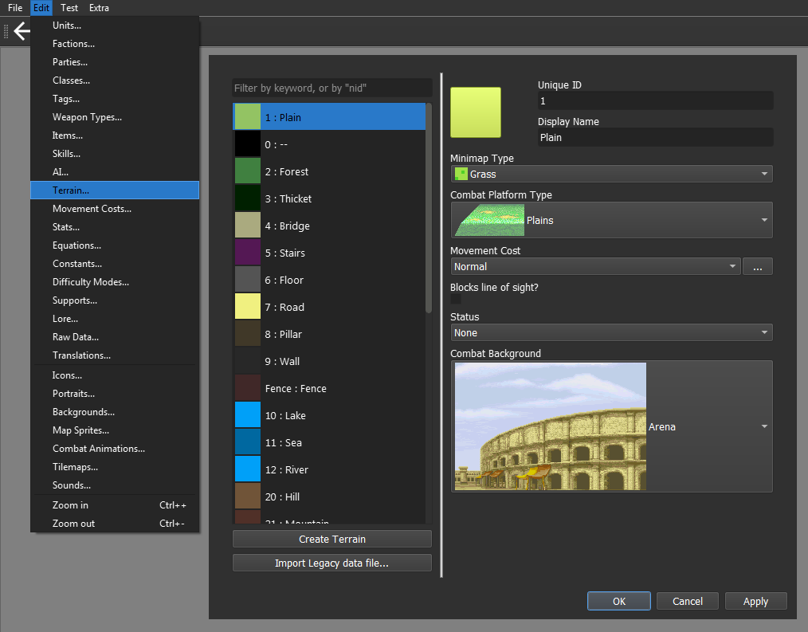

The default project has numbers assigned as the **Unique ID**, with a
few exceptions. They are right before the terrain name **(Display
Name)**.

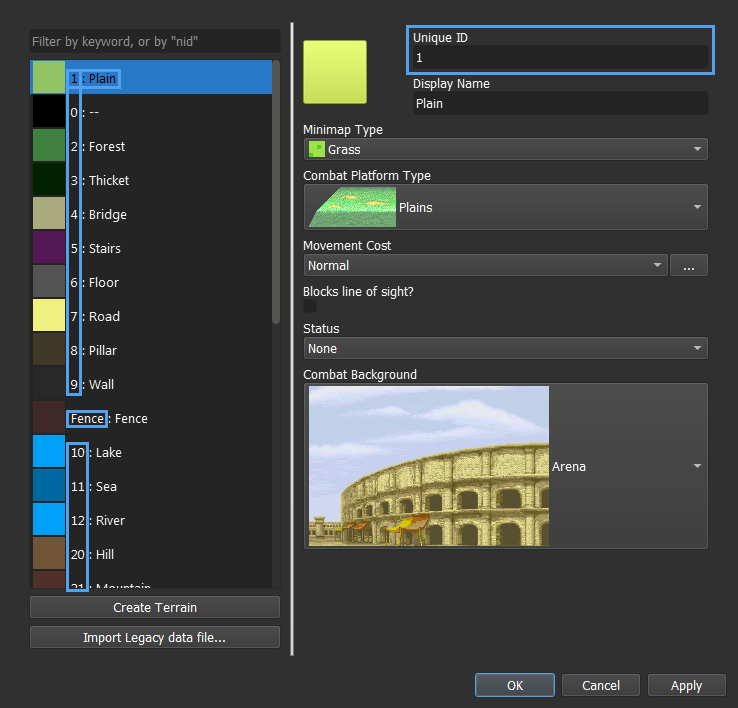

In case you haven’t done a single change to terrain, you can use the
following lists.

For indoors:

    '2', '3', '5', '8', '9', '25', '30', '31', '32', '33', '34', '35', '36', '37', '38', 'Arena', 'Ruins', 'Village Ruins'

For outdoors:

    '1', '4', '6', '7', '10', '11', '12', '20', '21', '22'

The final result may differ a lot depending on your project.

### Step 1.1: Check the maps<a href="Tile-Passives.html#step-1-1-check-the-maps" class="headerlink"
title="Link to this heading"></a>

In case you don’t know much about map editing and how the engine handles
it, you’ll likely want to be sure that the map is properly set.

Each tile has two major properties - *visual* and ***terrain***. This
means that whenever add a forest sprite tile to your map you’ll also
need to set that tile **terrain** as a forest, otherwise it won’t
understand it as such.

By disassociating these properties, we can create special tiles that
have a specific visual but a different terrain property, such as
creating an invisible barrier or maybe even a trap tile.

As a downside, it also means that it is possible for **terrain** to
unintentionally mismatch. We can fix that in the **Tilemaps Editor**,
found within the **Edit Menu**.

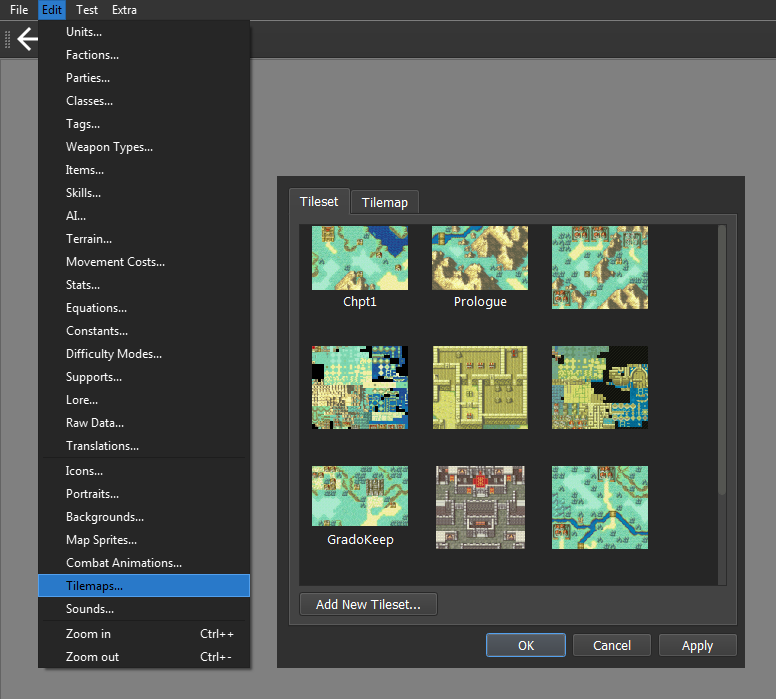

Select the **Tilemap** tab and the map that uses the same layout as the
test map and click on **Edit Current Tilemap…** We will use DEBUG as our
test map in this guide.

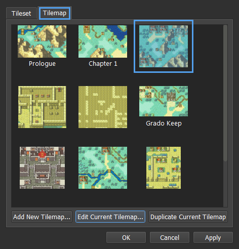

Click on the **Terrain Mode** button, represented by the **Mountain
icon**.

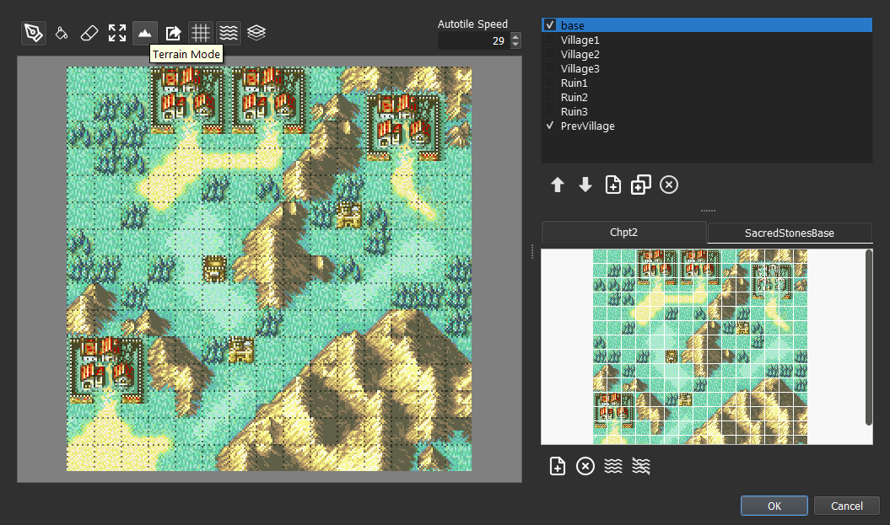

We can now see the **terrain** version of the map along the tools to
modify it.

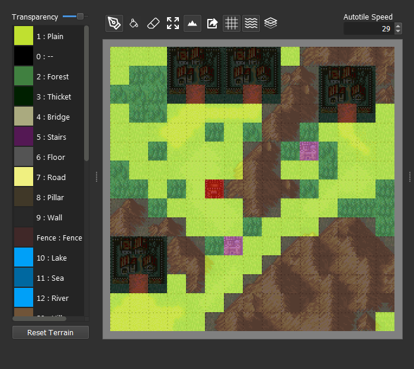

You can left click on a tile to select that terrain.

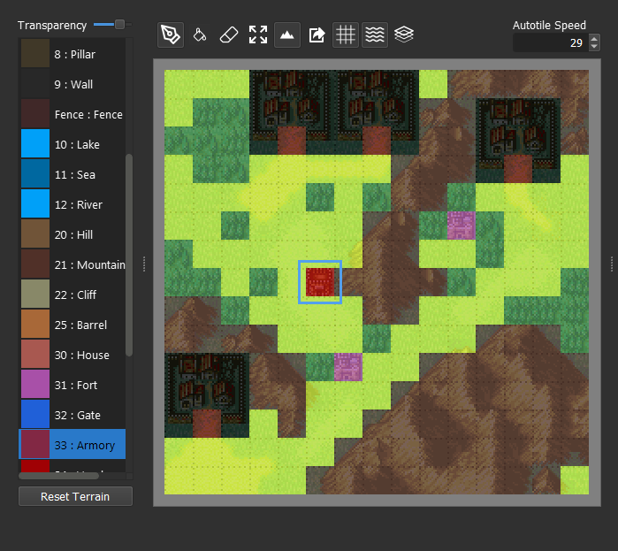

And right click a tile to attribute the current terrain to it.

We change the **transparency** by moving the slider at the top left.

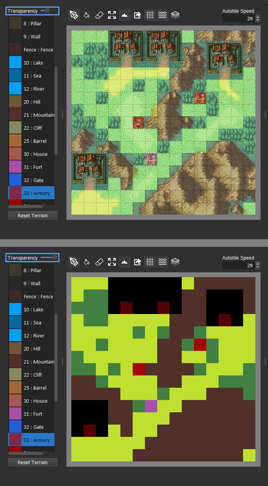

With this, we can be sure our tiles are matching their respective
terrains. You can run the chapter and move over each tile to see if you
get the right caption.

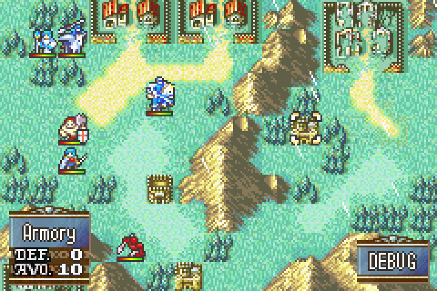

This allows us to test tiles without changing the visual completely.

We can also change the terrain color at the **Terrain Editor**.

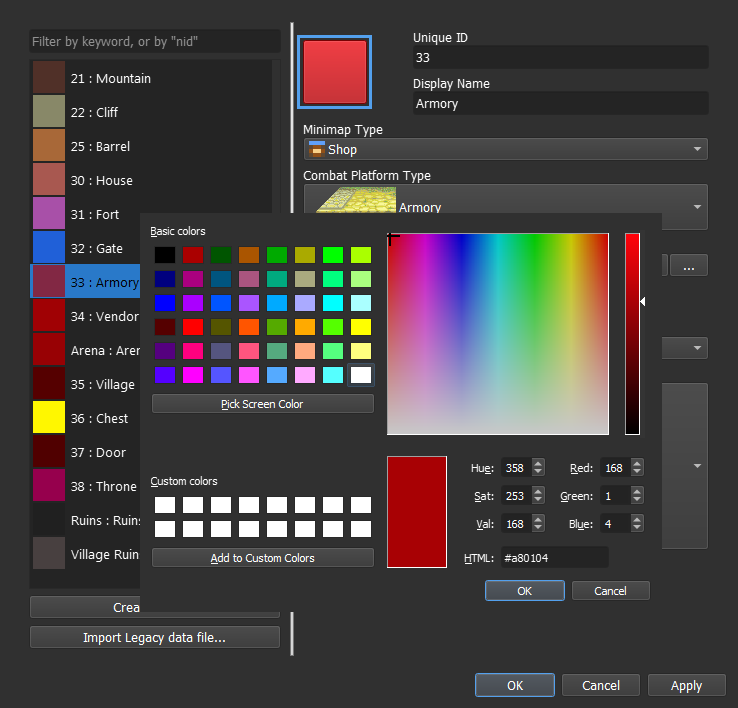

Now that our map is set, we can finally create our two skills.

## Step 2: Create a Class Skill<a href="Tile-Passives.html#step-2-create-a-class-skill"
class="headerlink" title="Link to this heading"></a>

## Step 3: Add the Combat Components<a href="Tile-Passives.html#step-3-add-the-combat-components"
class="headerlink" title="Link to this heading"></a>

## Step 4: Add and set the Condition component<a href="Tile-Passives.html#step-4-add-and-set-the-condition-component"
class="headerlink" title="Link to this heading"></a>

All information regarding the tiles is stored in the **tilemap object**,
which an only be accessed through the **global object game**. The
terrain information can be retrieved by using the **get_terrain()
method**. All we have to do is to give it a valid *‘X, Y’ coordinate*.

    game.tilemap.get_terrain({coordinate})

Every **unit** on the map also has an *‘X, Y’ coordinate*, stored in the
**position attribute**.

    unit.position

Then, combined as:

    game.tilemap.get_terrain(unit.position)

We can now make our condition by comparing it to a list containing all
of ours **Terrain** **Unique IDs**.

    game.tilemap.get_terrain(unit.position) in (... , ...)

And as better illustrative example:

    game.tilemap.get_terrain(unit.position) in ('1' , '5', '776', 'Grave', 'Dragon Bone')

The end result should look somewhat similar to this:

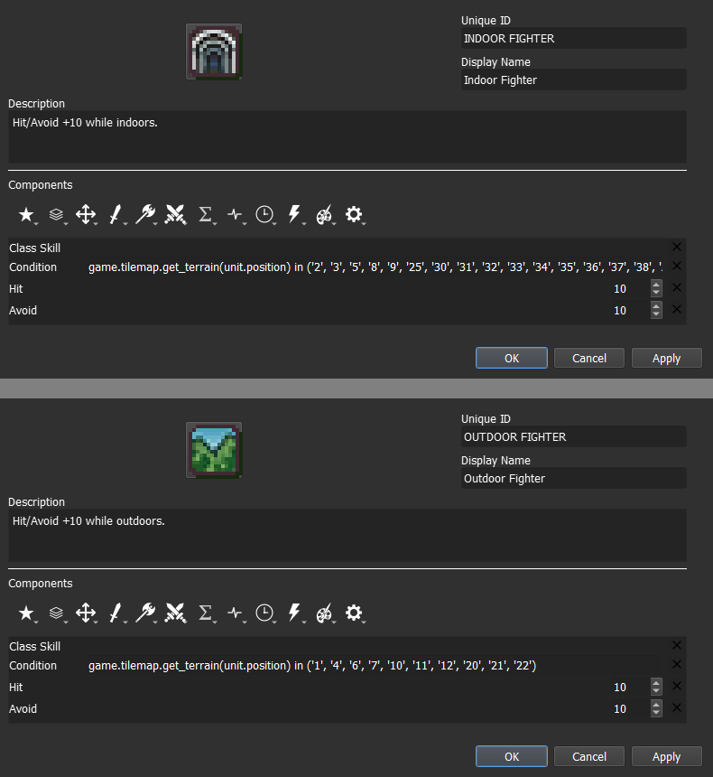

## Step 5: Test the stat alterations in-game<a href="Tile-Passives.html#step-5-test-the-stat-alterations-in-game"
class="headerlink" title="Link to this heading"></a>

<a href="Conditional-Passives-III.html"
class="btn btn-neutral float-left" accesskey="p" rel="prev"
title="3. Conditional Passives III - Tomefaire, Axe Breaker and Wyrmbane"> Previous</a>
<a href="Auras.html" class="btn btn-neutral float-right" accesskey="n"
rel="next" title="3. Auras - Hex, Bond and Focus">Next </a>

------------------------------------------------------------------------

© Copyright 2024, rainlash.

Built with [Sphinx](https://www.sphinx-doc.org/) using a
[theme](https://github.com/readthedocs/sphinx_rtd_theme) provided by
[Read the Docs](https://readthedocs.org).

